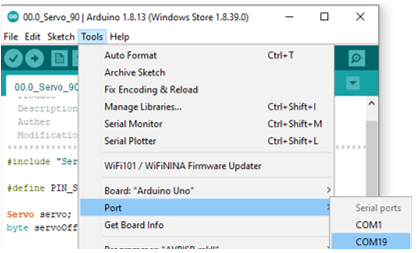
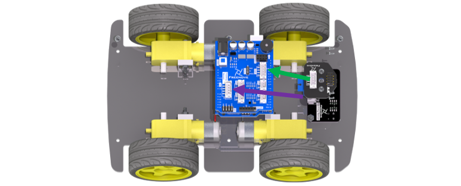

##############################################################################
Chapter 0 Software, Assembly and Play
##############################################################################

If you have any concerns, please feel free to contact us via support@freenove.com

0.1 Download and Install IDE.
*******************************************************************************

First, install Arduino IDE. Visit https://www.arduino.cc/en/software. Scroll down and find Legacy IDE (1.8.X). Then select and download corresponding installer according to your operating system. If you are a windows user, please select the "Windows Installer".

:red:`! Do not download “Arduino IDE 2.x.x” unless you are familiar with it, or you may encounter problems.`

:red:`! “Windows app” is not recommended. It is reported that it sometimes fails to work properly.`

After the download completes, run the installer and complete the installation.

Open the Arduino Software, the interface of Arduino Software is as follows:

Programs written with Arduino Software (IDE) are called sketches. These sketches are written in the text editor and are saved with the file extension .ino. The editor has features for cutting/pasting and for searching/replacing text. The message area gives feedback while saving and exporting and it also displays errors. The console displays text output by the Arduino Software (IDE), including complete error messages and other information. The bottom right corner of the window displays the configured board and serial port. The toolbar buttons allow you to verify and upload programs, create, open, and save sketches, and open the serial monitor.

.. list-table:: 
    
    * - |Chapter0_02|
      - Verify, Checks your code for errors compiling it. 
    
    * - |Chapter0_03|
      - Upload, Compiles your code and uploads it to the configured board. 

    * - |Chapter0_04|
      - New, Creates a new sketch.      

    * - |Chapter0_05|
      - Open, Presents a menu of all the sketches in your sketchbook. 
       
        Clicking one will open it within the current window overwriting its content.  

    * - |Chapter0_06|
      - Save, Saves your sketch.  

    * - |Chapter0_07|
      - Serial Monitor, Opens the serial monitor.  

Additional cSommands are found within the five menus: File, Edit, Sketch, Tools, Help. The menus are context sensitive, which means only those items relevant to the work currently being carried out are available.

0.2 Upload Servo Code (Necessary)
*******************************************

Upload code in Freenove_4WD_Car_Kit\\Sketches\\00.0_Servo_90 to Freenove control board of the car.

This code will be used in assembly step. 

Do not skip this step. Please remove Bluetooth Module Module when you upload code.

1 install Ch340 driver
==========================================

1)	Download the driver:

http://www.wch-ic.com/downloads/file/65.html

2)	**Connect the control board to your computer.**

3)	Double Click the exe file. Then click INSTALL.

For mac and linux, pease download the driver from here:

http://www.wch-ic.com/search?q=CH340&t=downloads

2 upload the code
==========================================

Open the example sketch " **00.0_Servo_90** " with Arduino IDE.

:red:`If the port doesn't work, please install the driver for the board.`

**Freenove_4WD_Car_Kit/Drivers**

Select board " **Arduino/Genuino Uno** ".

Check Port before connecting the control board to computer. 

.. note::
    
    Your port may be different from the following figure.

On **Windows**: It may be COM4, COM5 (Arduino Uno) or something like that.

On **Mac**: It may be /dev/cu.usbserial-710, /dev/cu.usemodem7101 (Arduino Uno) or something like that.

On **Linux**: It may be /dev/ttyUSB0, /dev/ttyACM0 or something like that.

Connect the control board to computer via USB cable. And then check Port again. You will find a COM added. That is the port of control board. Here it is COM19. In your computer, it would be a different number.

Click "Verify" button and “Upload” button. “Done uploading” indicates that the code is uploaded successfully.

0.3 Assembly
*******************************************

If you have any concerns, please feel free to contact us via support@freenove.com

In this chapter, we will learn how to assemble this car. This will spend some time. Please be patient.

+-----------------------------------------------------------------------------------------------------------------+
| Install Motor Bracket on bottom acrylic board, with screw M3*8 in the same bag.                                 |
|                                                                                                                 |
| |Chapter0_15|                                                                                                   |
+-----------------------------------------------------------------------------------------------------------------+
| In your kit, the bottom acrylic board may look like below:                                                      |
|                                                                                                                 |
| |Chapter0_16|                                                                                                   |
+-----------------------------------------------------------------------------------------------------------------+
| Install Motor Bracket on bottom acrylic board, with screw M3*30 and Nut M3 in the same bag.                     |
|                                                                                                                 |
| |Chapter0_17|                                                                                                   |
|                                                                                                                 |
| :red:`Caution: Do not remove the cable tie from the motor; otherwise, the motor cable may become detached.`     |
+-----------------------------------------------------------------------------------------------------------------+
| And then one motor will be installed successfully.                                                              |
|                                                                                                                 |
| |Chapter0_18|                                                                                                   |
+-----------------------------------------------------------------------------------------------------------------+
| Install the rest 3 sets of motors with the same method.                                                         |
|                                                                                                                 |
| |Chapter0_19|                                                                                                   |
+-----------------------------------------------------------------------------------------------------------------+
| Install wheel. Note, the hole is not round.                                                                     |
|                                                                                                                 |
| |Chapter0_20|                                                                                                   |
+-----------------------------------------------------------------------------------------------------------------+
| Install the rest 3 wheels.                                                                                      |
|                                                                                                                 |
| |Chapter0_21|                                                                                                   |
+-----------------------------------------------------------------------------------------------------------------+
| Install line tracking module with Screw M3*8 and Nut M3.                                                        |
|                                                                                                                 |
| |Chapter0_22|                                                                                                   |
+-----------------------------------------------------------------------------------------------------------------+
| If you have other kind of bottom acrylic board, please install the tracking module like below.                  |
|                                                                                                                 |
| |Chapter0_23|                                                                                                   |
+-----------------------------------------------------------------------------------------------------------------+
| Install LED 5x1 and LED controller to top acrylic board.                                                        |
|                                                                                                                 |
| |Chapter0_24|                                                                                                   |
+-----------------------------------------------------------------------------------------------------------------+
| Connect wiring of LED controller and LED 5X1. The wire need to be twisted 180°.                                 |
|                                                                                                                 |
| |Chapter0_25|                                                                                                   |
+-----------------------------------------------------------------------------------------------------------------+
| Install standoff on top acrylic board.                                                                          |
|                                                                                                                 |
| |Chapter0_26|                                                                                                   |
+-----------------------------------------------------------------------------------------------------------------+
| Install Freenove control board.                                                                                 |
|                                                                                                                 |
| |Chapter0_27|                                                                                                   |
+-----------------------------------------------------------------------------------------------------------------+
| Connect LED controller with extension board with jumper wire F-F 4P. Wires of LED are hidden.                   |
|                                                                                                                 |
| GND-GND, 5V-VCC, SCA-SCL, SDA-SDA.                                                                              |
|                                                                                                                 |
| |Chapter0_28|                                                                                                   |
+-----------------------------------------------------------------------------------------------------------------+
| Install battery holder.                                                                                         |
|                                                                                                                 |
| |Chapter0_29|                                                                                                   |
|                                                                                                                 |
| :red:`Some battery holders have short cable. Please rotate the battery holder for 180° to install.`             |
|                                                                                                                 |
| |Chapter0_30|                                                                                                   |
+-----------------------------------------------------------------------------------------------------------------+
| Install servo.                                                                                                  |
|                                                                                                                 |
| |Chapter0_31|                                                                                                   |
+-----------------------------------------------------------------------------------------------------------------+
| stall battery. And conect servo to servo port, yellow-SIG pin, red-5v, brown-GND.                               |
|                                                                                                                 |
| |Chapter0_32|                                                                                                   |
|                                                                                                                 |
| 18650 3.7V :red:`rechargeable` lithium battery x2 **It is easier to find proper battery on eBay than Amazon.**  |
+-----------------------------------------------------------------------------------------------------------------+
| Connect power supply to extension board (the top board, not control board board).                               |
|                                                                                                                 |
| |Chapter0_33|                                                                                                   |
|                                                                                                                 |
| If you have uploaded code before, just turn on the switch of extension board and battery holder.                |
|                                                                                                                 |
| If not, you need upload the code.                                                                               |
|                                                                                                                 |
| :red:`Some battery holders have short cable. Please rotate the battery holder for 180° to install.`             |
+-----------------------------------------------------------------------------------------------------------------+
| Install servo arm with sonic module connector. The screw and arm are in the same bag with servo.                |
|                                                                                                                 |
| |Chapter0_34|                                                                                                   |
+-----------------------------------------------------------------------------------------------------------------+
| Connect servo arm to servo. Make sure servo arm is installed at 90 degrees.                                     |
|                                                                                                                 |
| |Chapter0_35|                                                                                                   |
+-----------------------------------------------------------------------------------------------------------------+
| Connect the motor wire to the interface of the board. As below.                                                 |
|                                                                                                                 |
| |Chapter0_36|                                                                                                   |
+-----------------------------------------------------------------------------------------------------------------+
| Connect the ultrasonic and tracking modules to the board. As below.                                             |
|                                                                                                                 |
| |Chapter0_37|                                                                                                   |
|                                                                                                                 |
| :red:`Note: The cables of the ultrasonic module and the tracking module are as shown below.`                    |
|                                                                                                                 |
| |Chapter0_38|                                                                                                   |
|                                                                                                                 |
| The following shows the cable with wrong sequence. If you receive such cable, please contact us:                |
|                                                                                                                 |
| :orange:`support@freenove.com`                                                                                  |
|                                                                                                                 |
| |Chapter0_39|                                                                                                   |
+-----------------------------------------------------------------------------------------------------------------+
| Install ultrasonic module to acrylic board.                                                                     |
|                                                                                                                 |
| |Chapter0_40|                                                                                                   |
+-----------------------------------------------------------------------------------------------------------------+
| Plug ultrasonic module.                                                                                         |
|                                                                                                                 |
| |Chapter0_41|                                                                                                   |
+-----------------------------------------------------------------------------------------------------------------+
| Install standoff M3*40 on bottom acrylic board.                                                                 |
|                                                                                                                 |
| |Chapter0_42|                                                                                                   |
+-----------------------------------------------------------------------------------------------------------------+
| Install top acrylic board to standoff.                                                                          |
|                                                                                                                 |
| |Chapter0_43|                                                                                                   |
+-----------------------------------------------------------------------------------------------------------------+
| Now the whole assembly is completed.                                                                            |
|                                                                                                                 |
| :red:`Connect the power to upper port.`                                                                         |
|                                                                                                                 |
| |Chapter0_44|                                                                                                   |
+-----------------------------------------------------------------------------------------------------------------+

.. |Chapter0_16| image:: ../_static/imgs/0_Software,_Assembly_and_Play/Chapter0_16.png

.. |Chapter0_19| image:: ../_static/imgs/0_Software,_Assembly_and_Play/Chapter0_19.png

.. |Chapter0_40| image:: ../_static/imgs/0_Software,_Assembly_and_Play/Chapter0_40.png

.. |Chapter0_43| image:: ../_static/imgs/0_Software,_Assembly_and_Play/Chapter0_43.png
.. |Chapter0_44| image:: ../_static/imgs/0_Software,_Assembly_and_Play/Chapter0_44.png

0.4 How to Play
*******************************************

You can follow this video or the later steps to play this car:

Step 1 Add libraries
=============================================

.. raw:: html

   <iframe height="500" width="690" src="https://www.youtube.com/embed/HxXmkmQxEjY" frameborder="0" allowfullscreen></iframe>

Add :red:`all the 4 libraries` in folder Freenove_4WD_Car_Kit\\Librarys one by one.

:red:`If you have installed RF24 libraries, you need select to install Version 1.3.2`

Step 2 Upload Code
=============================================

If you want to use different control ways, you need to upload different codes.

IR remote control
--------------------------------------------

1)	Install IR receiver to the car. And remove the plastic paper from IR remote.

  
2)	Upload following code to the car board. Please remove Bluetooth Module when you upload code.

Freenove_4WD_Car_Kit\\Sketches\\04.4_One_Code_Multifunctional_IR_Remote_Car.ino

After uploading successfully, you can use the IR remote control to control the car.

After the code is successfully uploaded, turn on the power of the car and use the infrared remote control to control the car and other functions. The corresponding keys and their functions are shown in the following table:

+---------------+--------------------------+----------+----------------------------------------------------------+
|   Key graph   |        Key define        | Key code |                         Function                         |
+===============+==========================+==========+==========================================================+
| |Chapter0_51| | IR_REMOTE_KEYCODE_UP     | 0xFF02FD | move forward                                             |
+---------------+--------------------------+----------+----------------------------------------------------------+
| |Chapter0_52| | IR_REMOTE_KEYCODE_DOWN   | 0xFF9867 | move back                                                |
+---------------+--------------------------+----------+----------------------------------------------------------+
| |Chapter0_53| | IR_REMOTE_KEYCODE_LEFT   | 0xFFE01F | Turn left                                                |
+---------------+--------------------------+----------+----------------------------------------------------------+
| |Chapter0_54| | IR_REMOTE_KEYCODE_RIGHT  | 0xFF906F | Turn right                                               |
+---------------+--------------------------+----------+----------------------------------------------------------+
| |Chapter0_55| | IR_REMOTE_KEYCODE_CENTER | 0xFFA857 | Turn on buzzer                                           |
+---------------+--------------------------+----------+----------------------------------------------------------+
| |Chapter0_56| | IR_REMOTE_KEYCODE_1      | 0xFF30CF | Make the LED run mode 1 to scroll the rainbow color.     |
+---------------+--------------------------+----------+----------------------------------------------------------+
| |Chapter0_57| | IR_REMOTE_KEYCODE_4      | 0xFF10EF | Make LED run mode 2, changing the color of the water LED |
+---------------+--------------------------+----------+----------------------------------------------------------+
| |Chapter0_58| | IR_REMOTE_KEYCODE_2      | 0xFF18E7 | The color of the LED bar changes faster.                 |
|               |                          |          |                                                          |
|               |                          |          | The color is from ColorWheel.                            |
+---------------+--------------------------+----------+----------------------------------------------------------+
| |Chapter0_59| | IR_REMOTE_KEYCODE_3      | 0xFF7A85 | The color of the LED bar changes slower.                 |
+---------------+--------------------------+----------+----------------------------------------------------------+
| |Chapter0_60| | IR_REMOTE_KEYCODE_5      | 0xFF38C7 | The LED bar cycle period is decreased,                   |
|               |                          |          |                                                          |
|               |                          |          | and the LED bar changes at a faster speed                |
+---------------+--------------------------+----------+----------------------------------------------------------+
| |Chapter0_61| | IR_REMOTE_KEYCODE_6      | 0xFF5AA5 | The LED bar cycle period is increased,                   |
|               |                          |          |                                                          |
|               |                          |          | and the LED bar changes at a slower speed                |
+---------------+--------------------------+----------+----------------------------------------------------------+

.. |Chapter0_52| image:: ../_static/imgs/0_Software,_Assembly_and_Play/Chapter0_52.png

.. |Chapter0_57| image:: ../_static/imgs/0_Software,_Assembly_and_Play/Chapter0_57.png

.. |Chapter0_59| image:: ../_static/imgs/0_Software,_Assembly_and_Play/Chapter0_59.png

.. |Chapter0_61| image:: ../_static/imgs/0_Software,_Assembly_and_Play/Chapter0_61.png

RF remote control
--------------------------------------------

Download tutorial and code to **assemble** remote controller.

https://github.com/Freenove/Freenove_Remote_Control_Kit/archive/refs/heads/master.zip

**Remove IR reviver and install RF module.**

You need remove Bluetooth Module when you upload code.

Upload following code to the car board.

**Freenove_4WD_Car_Kit\\Sketches\\05.5_One_Code_Multifunctional_RF24_Remote_Car**

Upload following code to the RF remote control.

**Freenove_4WD_Car_Kit\\Sketches\\05.1_RF24_Remote_Controller**

Switch different modes
--------------------------------------------

1, Change the switch state of S1, S2, and S3, and the car will stop moving.

2, Press the Z axis of the joystick and the buzzer B sounds to indicate that the mode is successfully switched.

The following table shows the modes indicated by the different states of the three switches S1, S2, and S3. 

The LED next to the switch illuminates to indicate ON and OFF state of switches. The three switches can form 2x2x2=8 modes.

+-----+-----+-----+----------+------------------------------------+
| S1  | S2  | S3  | Mode No. |                Mode                |
+=====+=====+=====+==========+====================================+
| ON  | ON  | ON  | 0        | None                               |
+-----+-----+-----+----------+------------------------------------+
| ON  | ON  | OFF | 1        | Calibrate servo mode               |
+-----+-----+-----+----------+------------------------------------+
| ON  | OFF | ON  | 2        | None                               |
+-----+-----+-----+----------+------------------------------------+
| ON  | OFF | OFF | 3        | Obstacle avoidance mode            |
+-----+-----+-----+----------+------------------------------------+
| OFF | ON  | ON  | 4        | None                               |
+-----+-----+-----+----------+------------------------------------+
| OFF | ON  | OFF | 5        | Line tracking mode                 |
+-----+-----+-----+----------+------------------------------------+
| OFF | OFF | ON  | 6        | Switch LED mode                    |
+-----+-----+-----+----------+------------------------------------+
| OFF | OFF | OFF | 7        | Manuel control mode / Default mode |
+-----+-----+-----+----------+------------------------------------+

Mode 0, 2, 4
--------------------------------------------

Reserved. We did not assign functions for them. 

Mode 1-Calibrate servo
--------------------------------------------

If your servo is not accurately mounted at 90 degrees, you can use this mode for fine adjustment (+-10 degrees).

In this mode, you can adjust potentiometer 2 (POT2) to fine tune the angle of the servo. When you adjust the servo to the correct angle, press the Z-axis of joystick to save calibration data to EEPROM. It will be saved permanently unless it is modified.

Mode 3-obstical avoidance, Mode 5-line tracking mode
---------------------------------------------------------

These two modes have been learned separately in the previous project, and their running logic and codes are consistent with the previous project.

The difference is that in this project, the car can respond to commands from the remote control at any time. Therefore, in this project, it is still necessary to communicate with the remote controller in these two modes. When the remote control signal is disconnected, the car will stop. Therefore, the normal communication between the remote control and the car should be maintained at any time. Poor communication conditions may cause these two modes to work abnormally.

Mode 6-switch LED display mode
---------------------------------------------------------

There are three display modes for the LEDs on the car, which are 0-flowing rainbow, 1-flowing water led, 2-Blink. In this mode, the display mode of the LED can be switched.

After entering this mode,

Move the joystick along the positive direction of its X-axis to switch the LED to the next mode.

Move the joystick in the negative direction of its X-axis to switch the LED to the previous mode.

In any mode, the LEDs can be adjusted with potentiometers P1 and P2. P1 is used to adjust the color change of the LED, and P2 is used to adjust the change frequency of LED.

Mode 7-manual remote mode
---------------------------------------------------------

This mode is manual remote mode and is the default mode. This mode is consistent with the previous project "RF_Remote_Car". Use the joystick to control to move forward, move back and turn left, turn right.

App control
----------------------------------------------------------

Download and install app. You can use app to control the robot.

You can download Freenove App through below ways:

View or download on Google Play:

https://play.google.com/store/apps/details?id=com.freenove.suhayl.Freenove

Or download APK file directly

https://github.com/Freenove/Freenove_App_for_Android/raw/master/freenove.apk

Then install it on your Android phone.

For **iPhone app**, please serach **freenove** in **App Store**.

Connect car to computer with USB cable. 

1 You need remove Bluetooth Module first when you upload code.

2 Then upload the code in Sketches/06.4_One_Code_Multifunctional_Bluetooth_Remote_Car.

3 After upload, reconnect the Bluetooth and reset the uno board.

**Click following icon.**

**Click BT05 or JDY-33-BLE (Default name).**

:blue:`The following chapters will teach you how to control components.`