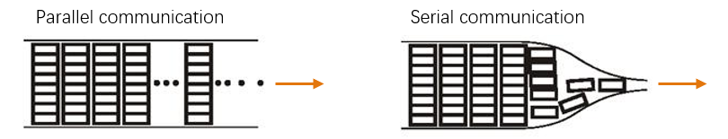

##############################################################################
Chapter 1 Control Basic Components
##############################################################################

This chapter will introduce how to control motor, buzzer, RGB LED and get battery level.

If you have any concerns, please feel free to contact us via support@freenove.com

1.1 Motor
******************************

When motor is connected to the power supply, it will rotate in one direction. Reverse the polarity of power supply, the motor will rotate in the opposite direction.

And the speed of motor depends on the voltage between two ends. The larger the voltage, the lager the speed.

PWM
==============================

PWM, Pulse Width Modulation, uses digital pins to send certain frequencies of square waves, that is, the output of high levels and low levels, which alternately last for a while. The total time for each set of high levels and low levels is generally fixed, which is called the period (the reciprocal of the period is frequency). The time of high level outputs are generally called “pulse width”, and the duty cycle is the percentage of the ratio of pulse duration, or pulse width (PW) to the total period (T) of the waveform.

The longer the output of high levels last, the larger the duty cycle and the higher the corresponding voltage in analog signal will be. The following figures show how the analogs signal voltage vary between 0V-5V (high level is 5V) corresponding to the pulse width 0%-100%: 

The longer the PWM duty cycle is, the higher the output power will be. Now that we understand this relationship, we can use PWM to control the brightness of an LED or the speed of DC motor and so on.

In this car, M1 and M2 are connected in parallel; M3 and M4 are connected in parallel. Schematic is below:

D3 and D5 pins of control board control M3 and M4 respectively. D4 and D6 pins of board control M1 and M2.

Code
==========================

01.1.1_RunMotor_Left_Wheel
------------------------------

If you don't know how to upload code to Arduino, you can refer to First Use.

You need remove Bluetooth Module Module when you upload code.

Next turn off the power. And connect control board to computer with a USB cable. Upload code in the folder: Sketches\\01.1.1_RunMotor_Left_Wheel

Then disconnect USB cable and put your car in a place with enough space to move. Or make the car's head stand up and observe the wheel. The following code also requires this step.

Turn on the power of Car. Then the left motors and wheels of car will rotate forth and back. And you can see the speeds are different. You can turn off the power of the car to stop that.

From previous section, we have known that M1 and M2 are connected in parallel andM3 and M4 are connected in parallel. It means that you can only control motors in the same side together but not separately. Usually, motors of the same side don't need to rotate in different directions. 

The code is below:

.. literalinclude:: ../../../freenove_Kit/Sketches/01.1.1_RunMotor_Left_Wheel/01.1.1_RunMotor_Left_Wheel.ino
    :linenos: 
    :language: c
    :dedent:

In the code, following code is uses to define pins.

.. literalinclude:: ../../../freenove_Kit/Sketches/01.1.1_RunMotor_Left_Wheel/01.1.1_RunMotor_Left_Wheel.ino
    :linenos: 
    :language: c
    :lines: 6-9
    :dedent:

As you can see in schematic above. The pin for motors cannot be modified.

**#define A B** , it means A is B. Use A instead of B for easy maintenance and easy reading.

You can also define pins with int type, like int PIN_DIRECTION_RIGHT=3; But this need more RAM space. 

Usually, there are two basic main functions for Arduino code, void setup() and void loop().

.. py:function:: void setup(){}

    The setup() function is called when a sketch starts, which is used to initialize variables, pin modes, start using libraries, etc. 
    
    The setup() function will **only run once**, after each **power up** or **reset** of the Arduino board.

.. py:function:: void loop(){}

    This function will loop consecutively. Code in this function will be executed again and again

    There are some other functions integrated by Arduino.

.. py:function:: pinMode(pin, mode)

    Configures the specified pin to behave either as an input or an output. 
    
    **Parameters**

    **pin:** Arduino pin number to set the mode of.

    **mode:** INPUT, OUTPUT, or INPUT_PULLUP.

.. py:function:: digitalWrite(pin, value)

    Write a HIGH or a LOW value to a digital pin.
    
    If the pin has been configured as an OUTPUT with pinMode(), its voltage will be set to the corresponding value: 5V (or 3.3V on 3.3V boards) for HIGH, 0V (ground) for LOW.
    
    Parameters
    
    **pin:** Arduino pin number.
    
    **value:** HIGH or LOW.

.. py:function:: analogWrite(pin, value)

    Writes an analog value (PWM wave) to a pin. 
    
    You do not need to call pinMode() to set the pin as an output before calling analogWrite().
    
    **Parameters**
    
    **pin:** Arduino pin to write to. Allowed data types: int.
    
    **value:** the duty cycle: between 0 (always off) and 255 (always on). Allowed data types: int.

For more details, please refer to: https://www.arduino.cc/reference/

Note, as to analogWrite(pin, value) of motors for this car, the maximum value is 255.As the motor requires a certain voltage to run, and analogwirte (pin, 1) doesn’t meet such required voltage., according to different voltage, the value that makes the car run will be much greater than analogwirte (pin, 1).  

01.1.2_RunMotor_Right_Wheel
---------------------------------------

:red:`You need remove Bluetooth Module Module when you upload code.`

Upload code in folder: Sketches\\01.1.2_RunMotor_Right_Wheel.

Then put your car in a place with enough space to move. Turn ON the power of car. Then the right motors and wheels of car will rotate forth and back. And you can see that the speeds are different. 

Because the left motors and right motors are mirrored. When the motors rotate with same direction, the car will react with reversed direction. 

The code is below:

.. literalinclude:: ../../../freenove_Kit/Sketches/01.1.2_RunMotor_Right_Wheel/01.1.2_RunMotor_Right_Wheel.ino
    :linenos: 
    :language: c
    :dedent:

01.1.3_Car_Move_and_Turn
----------------------------------------

:red:`You need remove Bluetooth Module Module when you upload code.`

Upload code in folder: Sketches\\01.1.3_Car_Move_and_Turn.

Then put your car in a place with enough space to move. Turn ON the power of car. Then the car will move forth and back, then turn left and turn right. After stopping for 2 second, it repeat the actions.

The code is below:

.. literalinclude:: ../../../freenove_Kit/Sketches/01.1.3_Car_Move_and_Turn/01.1.3_Car_Move_and_Turn.ino
    :linenos: 
    :language: c
    :dedent:

:red:`If you find that the motor is turning in the opposite direction as described in the code, please change the 0 in the code to 1.`

.. code-block:: c
    :linenos:

    #define MOTOR_DIRECTION     0 //If the direction is reversed, change 0 to 1

Now we will use motorRun(200, -200) as an example to introduce this function.

.. literalinclude:: ../../../freenove_Kit/Sketches/01.1.3_Car_Move_and_Turn/01.1.3_Car_Move_and_Turn.ino
    :linenos: 
    :language: c
    :lines: 41-60
    :dedent:

The left motors and right motors are mirrored. When the motors on two side rotate with same direction, the car will turn. In order to make a car move forth or back, we need set motor on two side with different direction.

So motorRun(200, -200) will make the car turn right. 

1.2 Buzzer and Battery level
*****************************************

A buzzer is an audio component. There are both active and passive types of buzzers. Active buzzers have oscillator inside, these will sound as long as power is supplied. Passive buzzers require an external oscillator signal (generally using PWM with different frequencies) to make a sound.

Active buzzers are easier to use. Generally, they can only make a specific sound frequency. 

Passive buzzers require an external circuit to make sounds, but they can be controlled to make  sounds of various frequencies. The resonant frequency of the passive buzzer is 2kHz, which means the passive buzzer is the loudest when resonant frequency is 2kHz.

In this car, the buzzer is an active buzzer. So it can only make a specific frequency of sound. Function tone() of Arduino cannot be used for this kind of buzzer.

Since the control board has limited number of IOs. Buzzer and battery level are not used frequently. So we use one IO of control board controlling buzzer and detecting battery level in different time

The schematic of buzzer and battery is below:

As you can see they use same IO A0.

Battery level should be :red:`Vm=4*V0`. V0 is the voltage detected by A0 of control board. 

The maximum battery level is 8.4v (V0=2.1V). 

The right circuit means if V0>4.5V, the buzzer will make sound. 

If V0 is within(0~2.1v), it is used for battery. If V0>4.5V, it is used for buzzer.

Serial Communication
---------------------------------------

Serial communication uses one data cable to transfer data one bit by another in turn. Parallel communication means that the data is transmitted simultaneously on multiple cables. Serial communication takes only a few cables to exchange information between systems, which is especially suitable for computers to computers, long distance communication between computers and peripherals. Parallel communication is faster, but it requires more cables and higher cost, so it is not appropriate for long distance communication.

Serial communication generally refers to the Universal Asynchronous Receiver/Transmitter (UART), which is commonly used in electronic circuit communication. It has two communication lines, one is responsible for sending data (TX line) and the other for receiving data (RX line). The serial communication connections of two devices use is as follows:

Code 
========================================

01.2.1_Buzzer
---------------------------------

You need remove Bluetooth Module Module when you upload code.

Upload code in Sketches\\01.2.1_Buzzer. Then turn the switch of car.

You will hear b-bbbb----bbbb----bbbb---- ......

The code in setup() is only executed once. Code in loop() will be executed circularly.

.. literalinclude:: ../../../freenove_Kit/Sketches/01.1.3_Car_Move_and_Turn/01.1.3_Car_Move_and_Turn.ino
    :linenos: 
    :language: c
    :dedent:

01.2.2_Battery_level
---------------------------------

Upload code in Sketches\\01.2.2_Battery_level. Don't disconnect the USB cable. Then turn on the switch of the car. 

And then click the Serial Monitor icon to open the Serial Monitor window.

Then you will hear buzzer making sounds twice. And then see the Interface of Serial Monitor window as follows. If you can't open it, make sure Freenove control board had been connected to the computer, and choose the right serial port in the menu bar "Tools-Port".

The code is below:

.. literalinclude:: ../../../freenove_Kit/Sketches/01.2.2_Battery_level/01.2.2_Battery_level.ino
    :linenos: 
    :language: c
    :dedent:

In this code, different Data Types are mentioned: float, bool, void.

If you are not familiar with data types, please refer to https://www.arduino.cc/reference/

.. image:: ../_static/imgs/1_Control_Basic_Components/Chapter1_11.png
  :align: center

The function is defined in form: data type function name ().

If it is void function name(), after it is executed, it will return nothing.

Code is always executed line by line. When if (getBatteryVoltage()) is executed, the program will turn to execute bool getBatteryVoltage(){    }. After return, the program will execute code in if {     }.

.. py:function:: Serial.print()	
    
    Syntax is below:
    
    Serial.print(val)
    
    Serial.print(val, format)
    
    Serial: serial port object. See the list of available serial ports for each board on the Serial main page.
    
    val: the value to print. Allowed data types: any data type.
    
    The only difference is that Serial.pritnln() will send a “\\n”. content of next print() or println() will be shown in a new line.

.. py:function:: analogRead( pin)	
    
    It will map input voltages between 0 and the operating voltage(5V or 3.3V) into integer values between 0 and 1023. For 5v as an example, ADCvalue= analogRead( pin) 
    
    If you want to get the voltage value. It should be V=ADCvalue/1023*5V. 

1.3 RGB
**************************************

A RGB LED has 3 LEDs integrated into one LED component. It can respectively emit Red, Green and Blue light. In order to do this, it requires 4 pins (this is also how you identify it). The long pin (1) is the common which is the Cathode (+) or positive lead, the other 3 are the Anodes (-) or negative leads. A rendering of a RGB LED and its electronic symbol are shown below. We can make RGB LED emit various colors of light and brightness by controlling the 3 Anodes (2, 3 & 4) of the RGB LED

Red, Green, and Blue light are called 3 Primary Colors when discussing light (Note: for pigments such as paints, the 3 Primary Colors are Red, Blue and Yellow). When you combine these three Primary Colors of light with varied brightness, they can produce almost any color of visible light. Computer screens, single pixels of cell phone screens, neon lamps, etc. can all produce millions of colors due to this phenomenon.

We know from previous section that, control board controls LEDs to emit a total of 256(0-255) different brightness with PWM. So, through the combination of three different colors of LEDs, RGB LED can emit 256^3=16777216 Colors, 16Million colors.

Include Library
=====================================

Enter “Freenove_WS2812B_RGBLED_Controller” and press “Enter” key to search.

Find and install the latest version (now it is version 1.0.0).

Code 
=================================

01.3_Led_Strip
---------------------------------

:red:`You need remove Bluetooth Module Module when you upload code.`

Upload code in Sketches\\01.3_Led_Strip. Then turn the power of car.

You can find a proper view to observe LED colors on the bottom acrylic board.

You will see that all LEDs show red, green, blue, yellow in turn. Then all LEDs turn off.

Then first 5 LEDs show different colors one by one. Then all LEDs show the same color and the color changes smoothly. Then different LEDs show different colors and they change smoothly.

The code is below:

.. literalinclude:: ../../../freenove_Kit/Sketches/01.3_Led_Strip/01.3_Led_Strip.ino
    :linenos: 
    :language: c
    :dedent:

First, you need install and include the library.

.. code-block:: c
    
    #include "Freenove_WS2812B_RGBLED_Controller.h"

Then set number of LED. The maximum is 255. But it is limited by power supply.

.. code-block:: c
    
    #define LEDS_COUNT   10  //it defines number of LEDs

There are two ways to set LED color.

**A**, set LED color directly.

1)	set all LED colors

.. py:function:: strip.setAllLedsColor(rgb value)

    rgb value should be Hexadecimal value, like strip.setAllLedsColor(0x0000FF).

.. py:function:: strip.setAllLedsColor(rvalue, gvalue, bvalue)

    This is another form, Like strip.setAllLedsColor(255, 255, 0).

    You can find more rgb values and colors here https://www.rapidtables.com/web/color/RGB_Color.html

2)	set color for one LED

.. py:function:: strip.setLedColor( LED_Index, rgb_value) or strip.setLedColor(LED_Index, rvalue, gvalue, bvalue)

    LED No. starts from 0, like strip.setLedColor(0, 255, 0, 0).

**B**, Set color data first. Then use show function.

This is a more efficient way to set colors for many LEDs. It will make the code run faster than before.

1)set all LED color

.. py:function:: strip.setAllLedsColorData( rgb value) or strip.setAllLedsColorData( rvalue, gvalue, bvalue)

    After you complete setting color, just add **strip.show()**

2)set color for one LED

.. py:function:: strip.setLedColorData( LED_Index, rgb value) or strip.setLedColorData( LED_Index, rvalue, gvalue, bvalue)

    After you complete setting color, just add **strip.show()**

.. py:function:: strip.Wheel(value)   value can be 0~255.

    Different values correspond to different colors. You can take **strip.Wheel(value)** as a rgb value to use in the code, like strip.setAllLedsColorData(strip.Wheel(k)).

You can find some examples of the library below:

1.4 Integrate functions
*************************************

Now we will write a code, which include all previous functions.

Code
=====================================

01.4.1_Integrate_Functions
---------------------------------------

:red:`You need remove Bluetooth Module Module first when you upload code.`

Upload code in Sketches\\01.4.1_Integrate_Functions. **Don't separate the files in the folder.**

Then put your car in a place with enough space to move. Turn ON the power of car.

.. literalinclude:: ../../../freenove_Kit/Sketches/01.4.1_Integrate_Functions/01.4.1_Integrate_Functions.ino
    :linenos: 
    :language: c
    :dedent:

01.4.2_Library_Integrate_Functions
---------------------------------------

Upload code in sketches\\01.4.2_Library_Integrate_Functions, which has the same function with code 01.4.1_Integrate_Functions. The only difference is that we write some codes into library. We will use this library later. 

**If libraries don't work on your computer, it may be related to your computer system.**

**Don't worry.  We also provide one code for later projects.**

The main code is as below. The Freenove_4WD_Car_for_Arduino.h has defined some pins, variables and functions. We can use them directly. We do not need redefine them again.

.. literalinclude:: ../../../freenove_Kit/Sketches/01.4.2_Library_Integrate_Functions/01.4.2_Library_Integrate_Functions.ino
    :linenos: 
    :language: c
    :dedent:

In this code, Freenove_4WD_Car_for_Arduino library is used.

.. code-block:: c
    
    #include "Freenove_4WD_Car_for_Arduino.h"

**And you can see, we did not define pins and functions in the main. But we can use them.**

Now let's learn a new skill, using library.

Open the directory Sketches\\01.4.2_Library_Integrate_Functions. You will see .cpp and .h file. They are **library files**.

When use the library in new code, you just need put this two files into the same directory of your code.

This library will be used latter, which will make programing more efficient. 

Now we will introduce content in the library.

First, **check Freenove_4WD_Car_for_Arduino.h.**

**This file defines some pins and function.** 

After you write the code 

.. code-block:: c
    
    #include "Freenove_4WD_Car_for_Arduino.h"

You will be able to use the pins define and functions in Freenove_4WD_Car_for_Arduino.h. And you don't need to define the pins and build the functions any more in your code.

.. literalinclude:: ../../../freenove_Kit/Sketches/01.4.2_Library_Integrate_Functions/Freenove_4WD_Car_for_Arduino.h
    :linenos: 
    :language: c
    :dedent:

Then check **Freenove_4WD_Car_for_Arduino.cpp**.

Its name should be the same as with .h file. We define functions in .h file and implement its content in .cpp.

You can see how the function work.

.. literalinclude:: ../../../freenove_Kit/Sketches/01.4.2_Library_Integrate_Functions/Freenove_4WD_Car_for_Arduino.cpp
    :linenos: 
    :language: c
    :dedent: