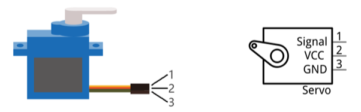
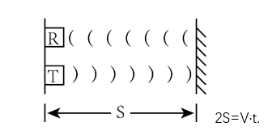
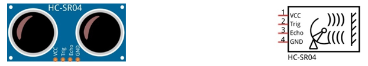
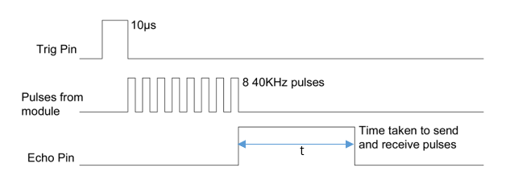
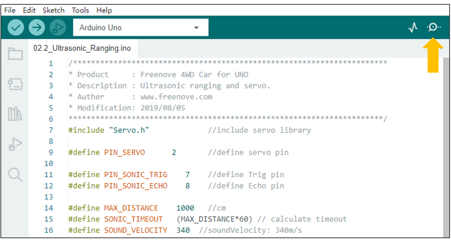
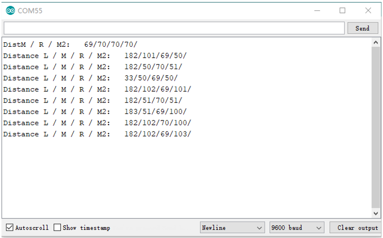
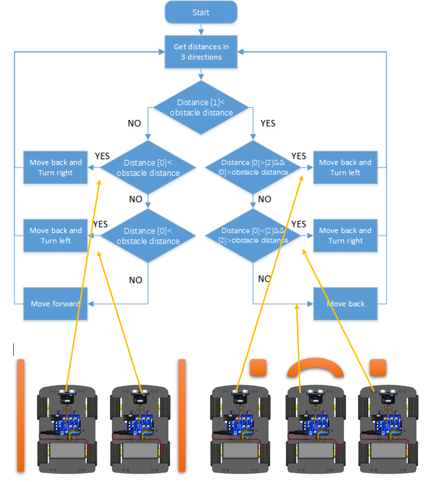
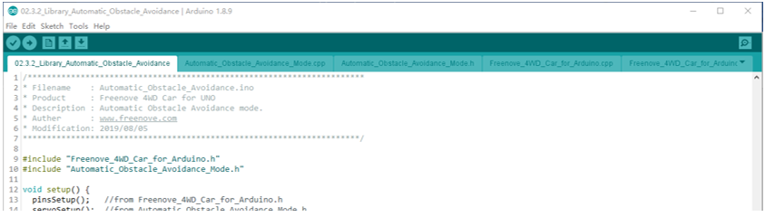

##############################################################################
Chapter 2 Obstacle avoidance
##############################################################################

In this chapter, we will introduce servo and ultrasonic module. And then make a car that can automatically obstacles.

If you have any concerns, please feel free to contact us via support@freenove.com

2.1 Servo
******************************

Servo is a compact package which consists of a DC Motor, a set of reduction gears to provide torque, a sensor and control circuit board. Most Servos only have a 180-degree range of motion via their “horn”. Servos can output higher torque than a simple DC Motor alone and they are widely used to control motion in model cars, model airplanes, robots, etc. Servos have three wire leads which usually terminate to a male or female 3-pin plug. Two leads are for electric power: Positive (2-VCC, Red wire), Negative (3-GND, Brown wire), and the signal line (1-Signal, Orange wire) as represented in the Servo provided in your Kit.

We will use a 50Hz PWM signal with a duty cycle in a certain range to drive the servo. The lasting time 0.5ms-2.5ms of PWM single cycle high level corresponds to the servo angle 0 degrees - 180 degrees linearly. Part of the corresponding values are as follows:

+-----------------+-------------+
| High level time | Servo angle |
+=================+=============+
| 0.5ms           | 0 degree    |
+-----------------+-------------+
| 1ms             | 45 degree   |
+-----------------+-------------+
| 1.5ms           | 90 degree   |
+-----------------+-------------+
| 2ms             | 135 degree  |
+-----------------+-------------+
| 2.5ms           | 180 degree  |
+-----------------+-------------+

When you change the servo signal, the servo will rotate to the designated position.

Code
===============================

02.1_Servo
-----------------------------

:red:`You need remove Bluetooth Module Module first when you upload code.`

Upload code in Sketches\\02.1_Servo. Then turn on the power of car.

Then you will see servo sweep among 45°, 90° and  135°.

The code is below:

.. literalinclude:: ../../../freenove_Kit/Sketches/02.1_Servo/02.1_Servo.ino
    :linenos: 
    :language: c
    :dedent:

.. py:function:: Servo library	
    
    There are some functions of this library:
    
    **servo.attach(pin)**
    
    Attach the Servo variable to a pin.
    
    pin: servo pin it is an initialization step to control a servo.

    **servo.write(angle)**
    
    Writes a value to the servo, controlling the shaft accordingly.
    
    angle: the value to write to the servo, from 0 to 180

For more details, please refer to: https://www.arduino.cc/en/Reference/Servo

2.2 Ultrasonic ranging module
***********************************

The Ultrasonic Ranging Module uses the principle that ultrasonic waves will reflect when they encounter any obstacles. This is possible by counting the time interval between when the ultrasonic wave is transmitted to when the ultrasonic wave reflects back after encountering an obstacle. Time interval counting will end after an ultrasonic wave is received, and the time difference (delta) is the total time of the ultrasonic wave’s journey from being transmitted to being received. Because the speed of sound in air is a constant, and is about v=340m/s, we can calculate the distance between the Ultrasonic Ranging Module and the obstacle: s=vt/2.

The HC-SR04 Ultrasonic Ranging Module integrates a both an ultrasonic transmitter and a receiver. The transmitter is used to convert electrical signals (electrical energy) into high frequency (beyond human hearing) sound waves (mechanical energy) and the function of the receiver is opposite of this. The picture and the diagram of the HC SR04 Ultrasonic Ranging Module are shown below:

Pin description:

+----------+------------+-------------------------------------------------------+
| Pin name | Pin number |                      Description                      |
+==========+============+=======================================================+
| Vcc      | 1          | Positive electrode of power supply, the voltage is 5V |
+----------+------------+-------------------------------------------------------+
| Trig     | 2          | Triger pin                                            |
+----------+------------+-------------------------------------------------------+
| Echo     | 3          | Echo pin                                              |
+----------+------------+-------------------------------------------------------+
| Gnd      | 4          | Negative electrode of power supply                    |
+----------+------------+-------------------------------------------------------+

Instructions for use:

Output a high-level pulse in Trig pin lasting for least 10uS, the module begins to transmit ultrasonic waves. At the same time, the Echo pin is pulled up. When the module receives the returned ultrasonic waves from encountering an obstacle, the Echo pin will be pulled down. The duration of high level in the Echo pin is the total time of the ultrasonic wave from transmitting to receiving, s=vt/2. This is done constantly.

Code
==================================

02.2_Ultrasonic_Ranging
------------------------------------

This project is used to set servo different angles and detect obstacle distance at each angle.

:red:`You need remove Bluetooth Module Module first when you upload code.`

Upload code in Sketches\\02.2_Ultrasonic_Ranging. 

Then turn on the power of car. Then open the serial monitor.

Then you will see servo sweep among 45°, 90°, 135°. And ultrasonic module detects different distance at different angles. All the distance values are printed below:

The code is below:

.. literalinclude:: ../../../freenove_Kit/Sketches/02.2_Ultrasonic_Ranging/02.2_Ultrasonic_Ranging.ino
    :linenos: 
    :language: c
    :dedent:

.. code-block:: c

    #define MAX_DISTANCE    1000   //cm
    #define SONIC_TIMEOUT   (MAX_DISTANCE*60) // calculate timeout 
    #define SOUND_VELOCITY  340  //sound Velocity: 340m/s

First calculate t for max distance. 

340 (t/10000000 )/2= MAX_DISTANCE /100    t= 58.8*MAX_DISTANCE      (Unit of t is μs) 

We set timeout to MAX_DISTANCE*60, a little larger, since the maximum distance of ultrasonic module is much larger.

.. code-block:: c
    
    pingTime = pulseIn(PIN_SONIC_ECHO, HIGH, SONIC_TIMEOUT); // Wait HC-SR04 returning to the high level 

If time of high level lasting time of echo is larger than SONIC_TIMEOUT, it will return 0. Then pingTime=0.

.. c:function:: pulseIn(pin, value, timeout)

    pin: the number of the Arduino pin on which you want to read the pulse.
    
    value: type of pulse to be read: either HIGH or LOW.
    
    timeout (optional): the number of microseconds to wait for the pulse to start; default is one second.
    
    For more details, please refer to: 
    
    https://www.arduino.cc/reference/en/language/functions/advanced-io/pulsein/

.. c:function:: Array

    An array is a collection of variables that are accessed with an index number.
    
    Define an array in Arduino.
    
    **Data type** 
    
    **Array name**
    
    **[Number of elements]**
    
    u8 distance[3]; define an array named distance, its data type is u8, which has 3 elements.
    
    The index starts from 0.
    
    u8 = **unsigned char**  Its range is 0~28 , namely 0~255.
    
    Range of u16 is 0~65535.
    
    For more details about array, please refer to:
    
    https://www.arduino.cc/reference/en/language/variables/data-types/array/

2.3 Automatic Obstacle Avoidance Car
******************************************

Code 
===================

02.3.1_Automatic_Obstacle_Avoidance
-------------------------------------

You need remove Bluetooth Module Module first when you upload code.

Upload code in Sketches\\02.3.1_Automatic_Obstacle_Avoidance. 

Then disconnect USB cable. Turn on the power of car. And put the car in a place with enough space to move.

The code is below:

.. literalinclude:: ../../../freenove_Kit/Sketches/02.3.1_Automatic_Obstacle_Avoidance/02.3.1_Automatic_Obstacle_Avoidance.ino
    :linenos: 
    :language: c
    :dedent:

We use analogWrite(PIN_MOTOR, PWM value) to make motor work. The PWM value represents different speeds when the voltage of battery changes. So we set a speedOffset to compensate the difference.

.. literalinclude:: ../../../freenove_Kit/Sketches/02.3.1_Automatic_Obstacle_Avoidance/02.3.1_Automatic_Obstacle_Avoidance.ino
    :linenos: 
    :language: c
    :lines: 125-128
    :dedent:

20 is tested value. You can try to test what is the most proper value.

We need control servo to 150°, 90°, 30°, 90°, 150°…

Get 5 ultrasonic module values (distance) at one angle. Then calculate the average distance. 

.. literalinclude:: ../../../freenove_Kit/Sketches/02.3.1_Automatic_Obstacle_Avoidance/02.3.1_Automatic_Obstacle_Avoidance.ino
    :linenos: 
    :language: c
    :lines: 50-75
    :dedent:

Then make the car react according to the distances above. About its logic, please refer to flow chart.

.. literalinclude:: ../../../freenove_Kit/Sketches/02.3.1_Automatic_Obstacle_Avoidance/02.3.1_Automatic_Obstacle_Avoidance.ino
    :linenos: 
    :language: c
    :lines: 77-108
    :dedent:

Code logic is as flow chart below:

Distance[0] is the left distance to obstacle. 

Distance[1] is the center distance to obstacle.

Distance[2] is the right distance to obstacle.

This project consider following 

02.3.2_Liberary_Automatic_Obstacle_Avoidance
------------------------------------------------

Code in sketches\\02.3.2_Liberary_Automatic_Obstacle_Avoidance includes a library 

The code function and content is similar to previous section. There are little difference. Previous code is more simple.

There are 4 labels. 

Freenove_4WD_Car_for_Arduino.h has introduced in section :ref:`01.4.2_Library_Integrate_Functions<fnk0041/codes/tutorial/1_control_basic_components:01.4.2_Library_Integrate_Functions>`

The main label is **02.3.2_Liberary_Automatic_Obstacle_Avoidance.ino**

Its code is below.

.. literalinclude:: ../../../freenove_Kit/Sketches/02.3.2_Library_Automatic_Obstacle_Avoidance/02.3.2_Library_Automatic_Obstacle_Avoidance.ino
    :linenos: 
    :language: c
    :dedent:

The code is very simple. The function from other labels.

Code in label Automatic_Obstacle_Avoidance_Mode.h

.. literalinclude:: ../../../freenove_Kit/Sketches/02.3.2_Library_Automatic_Obstacle_Avoidance/Automatic_Obstacle_Avoidance_Mode.h
    :linenos: 
    :language: c
    :dedent:

.h file used to define pins, variables and functions.

You can get information of what you can use from .h file.

The detailed implement code of the functions is included in .cpp file.

.. literalinclude:: ../../../freenove_Kit/Sketches/02.3.2_Library_Automatic_Obstacle_Avoidance/Automatic_Obstacle_Avoidance_Mode.cpp
    :linenos: 
    :language: c
    :dedent:

Since the servo may not be installed to 90°, we need adjust it. But we don't want to adjust it every time, so we can save the servoOffset in a place and next time, we can use it directly.. The microcontroller on the Arduino and Genuino boards have 1024 bytes of EEPROM.

It is useful when we use remote control to calibrate the servo.

.. literalinclude:: ../../../freenove_Kit/Sketches/02.3.2_Library_Automatic_Obstacle_Avoidance/Automatic_Obstacle_Avoidance_Mode.cpp
    :linenos: 
    :language: c
    :lines: 27-35
    :dedent:

.. py:function:: EEPROM
    The microcontroller on the Arduino and Genuino boards have 1024 bytes of EEPROM.
    
    EEPROM.write(address, val);   write val to address
    
    value = EEPROM.read(address);  read the data saved in address

    for example,
    
    EEPROM.write(0, 3);  
    
    EEPROM.write(1, 5);  
    
    EEPROM.write(2, 8);   
    
    Value0= EEPROM.read(0);   then Value0 = 3
    
    Value1 = EEPROM.read(2);   then Value2 = 8
    
    For more information, refer to https://www.arduino.cc/en/Reference/EEPROM

Other code logic is similar to previous section.