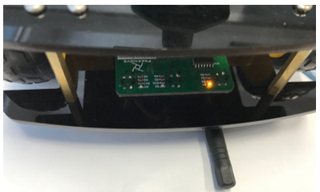
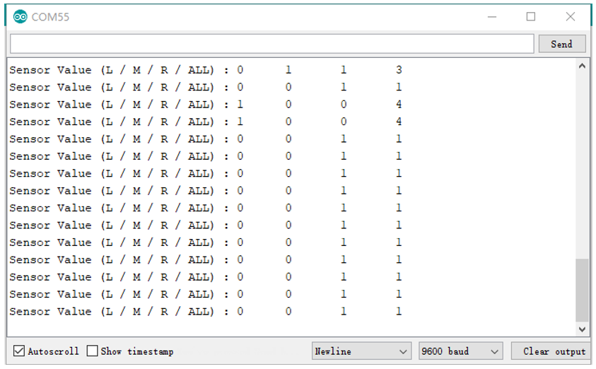
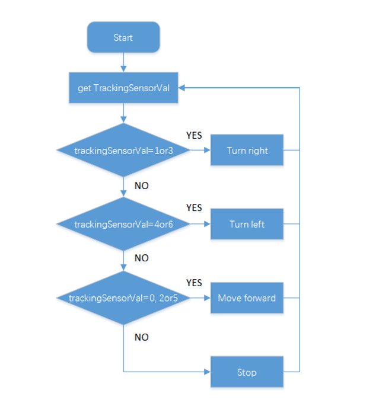
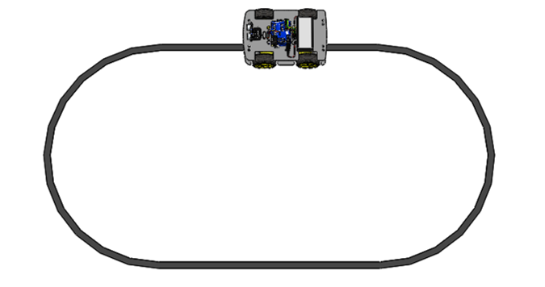

##############################################################################
Chapter 3 Line tracking
##############################################################################

In this chapter, we will introduce line-tracking sensor and make a line-tracking car.

If you have any concerns, please feel free to contact us via support@freenove.com

3.1 Line tracking sensor 
*********************************

There are three Reflective Optical Sensors on this car. When the infrared light emitted by infrared diode shines on the surface of different objects, the sensor will receive light with different intensities after reflection.

As we know, black objects absorb light better. So when black lines are drawn on the white plane, the sensor can detect the difference. The sensor can also be called Line Tracking Sensor.

:red:`Warning:`

:red:`Reflective Optical Sensor (including Line Tracking Sensor) should be avoided using in environment with infrared interference, like sunlight. Sunlight contains a lot of invisible light such as infrared and ultraviolet. Under environment with intense sunlight, Reflective Optical Sensor cannot work normally.`

The following table shows the values of all cases when three Tracking Sensors detect objects of different colors.

Among them, black objects or no objects were detected to represent 1, and white objects were detected to represent 0.

+------+--------+-------+---------------+----------------+
| Left | Middle | Right | Value(binary) | Value(decimal) |
+======+========+=======+===============+================+
| 0    | 0      | 0     | 000           | 0              |
+------+--------+-------+---------------+----------------+
| 0    | 0      | 1     | 001           | 1              |
+------+--------+-------+---------------+----------------+
| 0    | 1      | 0     | 010           | 2              |
+------+--------+-------+---------------+----------------+
| 0    | 1      | 1     | 011           | 3              |
+------+--------+-------+---------------+----------------+
| 1    | 0      | 0     | 100           | 4              |
+------+--------+-------+---------------+----------------+
| 1    | 0      | 1     | 101           | 5              |
+------+--------+-------+---------------+----------------+
| 1    | 1      | 0     | 110           | 6              |
+------+--------+-------+---------------+----------------+
| 1    | 1      | 1     | 111           | 7              |
+------+--------+-------+---------------+----------------+

Code 
==========================

03.1_Tracking_Sensor
--------------------------

:red:`You need remove Bluetooth Module Module first when you upload code.`

Upload code in Sketches\\03.1_Tracking_Sensor,  turn on the power, and  open the serial monitor. Put something black under the sensor. Move it and you will see different LEDs light up. 

The monitor is shown below:

The code is below:

.. literalinclude:: ../../../freenove_Kit/Sketches/03.1_Tracking_Sensor/03.1_Tracking_Sensor.ino
    :linenos: 
    :language: c
    :dedent:

.. py:function:: Bitwise Operators

    There are some Bitwise Operators.

    << (bitshift left)  

    If sensorValue[0] =1, sensorValue[1]= 1, sensorValue[2]=1

    sensorValue[0] << 2    then sensorValue[0]=100,(Binary), namely 4(Decimal)

    sensorValue[1] << 1    then sensorValue[0]=010,(Binary), namely 2(Decimal)

    sensorValue[2]=001(Binary)

    | (bitwise or) 

    The code turns to:   100 | 010 | 001 =111(Binary), namely 7(Decimal)

    >> (bitshift right) 

    & (bitwise and) 

    ^ (bitwise xor) 

    ~ (bitwise not) 

    For more information, please refer to: https://www.arduino.cc/reference/

3.2 Line tracking car
*********************************

The car will make different actions according to the value transmitted by the line-tracking sensor.

When 

+------+--------+-------+---------------+----------------+--------------+
| Left | Middle | Right | Value(binary) | Value(decimal) |    Action    |
+======+========+=======+===============+================+==============+
| 0    | 0      | 0     | 000           | 0              | move forward |
+------+--------+-------+---------------+----------------+--------------+
| 0    | 0      | 1     | 001           | 1              | Turn Right   |
+------+--------+-------+---------------+----------------+--------------+
| 0    | 1      | 0     | 010           | 2              | Move Forward |
+------+--------+-------+---------------+----------------+--------------+
| 0    | 1      | 1     | 011           | 3              | Turn Right   |
+------+--------+-------+---------------+----------------+--------------+
| 1    | 0      | 0     | 100           | 4              | Turn Left    |
+------+--------+-------+---------------+----------------+--------------+
| 1    | 0      | 1     | 101           | 5              | Move Forward |
+------+--------+-------+---------------+----------------+--------------+
| 1    | 1      | 0     | 110           | 6              | Turn Left    |
+------+--------+-------+---------------+----------------+--------------+
| 1    | 1      | 1     | 111           | 7              | Stop         |
+------+--------+-------+---------------+----------------+--------------+

Flow chart of line tracking car is as below: 

Code
======================================

03.2_Automatic_Tracking_Line
------------------------------------

You need remove Bluetooth Module Module first when you upload code.

Upload code in **Sketches\\03.3_One_Code_Automatic_Tracking_Line**. Turn on the power. Use a black tape to build a line and then put your car on it as below.

You can also choose 03.2_Automatic_Tracking_Line. The code is same.

The code is below.

.. literalinclude:: ../../../freenove_Kit/Sketches/03.1_Tracking_Sensor/03.1_Tracking_Sensor.ino
    :linenos: 
    :language: c
    :dedent:

.. py:function:: Exp1 ? Exp2 : Exp3;	
    
    If Exp1 is true, the result of this code is Exp2.
    
    If Exp1 is false, the result of this code is Exp3.
    
    For example
    
    If y=8; 
    
    var = (y < 10) ? 30 : 40;   then var=30
    
    If y=10
    
    var = (y < 10) ? 30 : 40;   then var=40

.. py:function:: switch...case	
    
    switch (var) {
    
    case 1:
        //do something when var equals 1

        break;
    
    case 2:
        //do something when var equals 2

        break;
    
    default:
        // if nothing else matches, do the default
        
        // default is optional

        break;
    }
    
    For more information, please refer to: 
    
    https://www.arduino.cc/reference/en/language/structure/control-structure/switchcase/