##############################################################################
Chapter 4 IR control 
##############################################################################

In this chapter, we will introduce infrared remote and receiver and make an IR remote control car.

If you have any concerns, please feel free to contact us via support@freenove.com

4.1 Infrared remote and receiver 

Infrared(IR) remote control is a device with a certain number of buttons. Pressing down different buttons will make the infrared emission tube, which is located in the front of the remote control, send infrared with different encodings. Infrared remote control technology is widely used, such as TV, air conditioning, etc. Thus, it makes it possible for you to switch TV programs and adjust the temperature of the air conditioning wheb you are away from them. The remote control we use is shown below:

This infrared remote control uses NEC encoding with a signal period of 108ms.

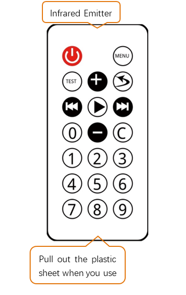

Infrared(IR) receiver is a component, which can receive the infrared light, so we can use it to detect the signal emitted by the infrared remote control. DATA pin here outputs the received infrared signal. 

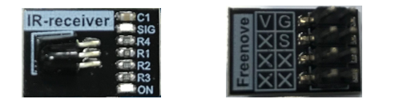

Install IR receiver on the car as below:

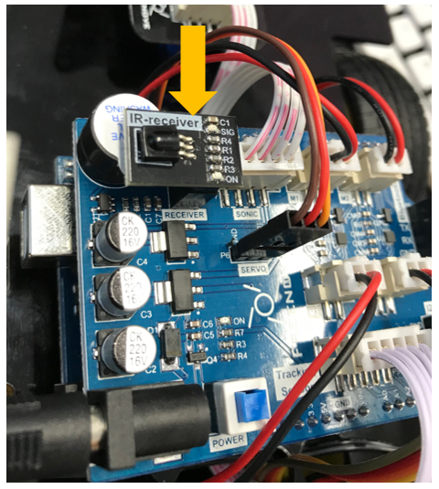

Code 
=========================

04.1_IR_Receiver
--------------------------

You need remove Bluetooth Module Module first when you upload code.

Then upload code in Sketches\\04.1_IR_Receiver, turn on the power and open the serial monitor.

And then pull off the plastic piece closed to the battery, and  press following keys in IR remote. 

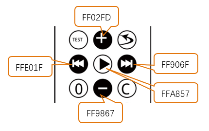

After receiving the signal from Infrared Emitter, the controller will recognize which key has been pressed. And print it in the monitor as below

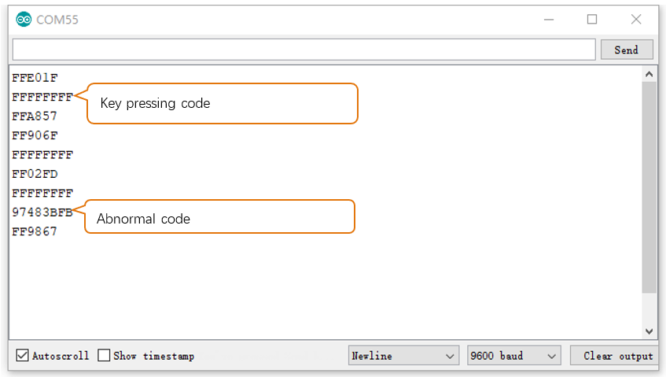

When you press one key lasting for some time, FFFFFFFF will be shown. It indicates that the key is in pressing state.

IR communication is not very stable, so it is easily to be interfered. When used, the transmitting LED of remote control must be aimed at the receiver. Otherwise, it may result in no data being received or incorrect data being received. 

In addition, sometimes the code received is abnormal. Except key codes and FFFFFFFF, other codes received are abnormal. When we process the code, we need skip this kind of data.

Different key code corresponds to different key.

.. literalinclude:: ../../../freenove_Kit/Sketches/04.1_IR_Receiver/04.1_IR_Receiver.ino
    :linenos: 
    :language: c
    :dedent:

4.2 IR Remote Car
********************************

We will use IR remote to control the car to make some actions.

Code
=================================

04.2_IR_Remote_Car
----------------------------------

:red:`You need remove Bluetooth Module Module first when you upload code.`

First, upload the code in Sketches\\04.2_IR_Remote_Car, and turn on the power of car. 

+---------------+--------------------------+----------+----------------+
|   Key graph   |        Key define        | Key code |    Function    |
+===============+==========================+==========+================+
| {Chapter4_05{ | IR_REMOTE_KEYCODE_UP     | 0xFF02FD | move forward   |
+---------------+--------------------------+----------+----------------+
| {Chapter4_06{ | IR_REMOTE_KEYCODE_DOWN   | 0xFF9867 | move back      |
+---------------+--------------------------+----------+----------------+
| {Chapter4_07{ | IR_REMOTE_KEYCODE_LEFT   | 0xFFE01F | Turn left      |
+---------------+--------------------------+----------+----------------+
| {Chapter4_08{ | IR_REMOTE_KEYCODE_RIGHT  | 0xFF906F | Turn right     |
+---------------+--------------------------+----------+----------------+
| {Chapter4_09{ | IR_REMOTE_KEYCODE_CENTER | 0xFFA857 | Turn on buzzer |
+---------------+--------------------------+----------+----------------+

The code is below:

.. literalinclude:: ../../../freenove_Kit/Sketches/04.2_IR_Remote_Car/04.2_IR_Remote_Car.ino
    :linenos: 
    :language: c
    :dedent:

Since the emission period of the infrared remote control is 108 ms, the signal timeout time is set to a rough value of 120 ms. If the timeout is less than 108 ms, the data will be read ahead of time and cannot be read. It will cause a misunderstanding that the signal is lost. If the timeout time is set too large, such as 1000ms, the delay of car action will be more serious.

.. code-block:: c
    :linenos:
    
    #define IR_UPDATE_TIMEOUT     120
    ......
        if (millis() - lastIRUpdateTime > IR_UPDATE_TIMEOUT) {
        if (!isStopFromIR) {
            isStopFromIR = true;
            motorRun(0, 0);
            setBuzzer(false);
        }
        lastIRUpdateTime = millis();
    }
    ......

You can change value of IR_CAR_SPEED to change speed of the car in range (0~255). In fact, since motor need enough voltage to make the car move so the minimum value is not 0. 

.. code-block:: c
    :linenos:
    
    #define IR_CAR_SPEED          180

.. py:function:: millis()

    Returns the number of milliseconds passed since the Arduino board began running the current program
    
        lastIRUpdateTime = millis(); //write down current time
    
    }
    
    else {
    
        if (millis() - lastIRUpdateTime)
    
    millis() - lastIRUpdateTime is the time from lastIRUpdateTime to current line.

    For more details, please refer to:
    
    https://www.arduino.cc/reference/en/language/functions/time/millis/

4.3 Multifunctional IR Remote Car
******************************************

In this project, we will add a LED bar function compared to the last section, so the infrared remote control car will have more functions.

Upload Code and Running
=========================================

You need remove Bluetooth Module Module first when you upload code.

Open the code in Sketches\\04.4_One_Code_Multifunctional_IR_Remote_Car. Upload it into car.

You can also choose to Sketches\\04.3_Multifunctional_IR_Remote_Car

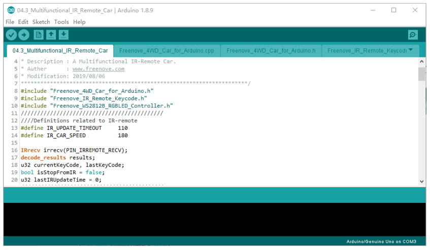

After the code is successfully uploaded, turn on the power of the car and use the infrared remote control to control the car and other functions. The corresponding keys and their functions are shown in the following table:

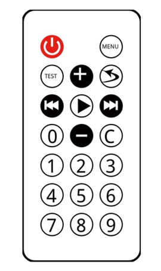

+---------------+--------------------------+----------+----------------------------------------------------------+
|   Key graph   |        Key define        | Key code |                         Function                         |
+===============+==========================+==========+==========================================================+
| |Chapter0_51| | IR_REMOTE_KEYCODE_UP     | 0xFF02FD | move forward                                             |
+---------------+--------------------------+----------+----------------------------------------------------------+
| |Chapter0_52| | IR_REMOTE_KEYCODE_DOWN   | 0xFF9867 | move back                                                |
+---------------+--------------------------+----------+----------------------------------------------------------+
| |Chapter0_53| | IR_REMOTE_KEYCODE_LEFT   | 0xFFE01F | Turn left                                                |
+---------------+--------------------------+----------+----------------------------------------------------------+
| |Chapter0_54| | IR_REMOTE_KEYCODE_RIGHT  | 0xFF906F | Turn right                                               |
+---------------+--------------------------+----------+----------------------------------------------------------+
| |Chapter0_55| | IR_REMOTE_KEYCODE_CENTER | 0xFFA857 | Turn on buzzer                                           |
+---------------+--------------------------+----------+----------------------------------------------------------+
| |Chapter0_56| | IR_REMOTE_KEYCODE_1      | 0xFF30CF | Make the LED run mode 1 to scroll the rainbow color.     |
+---------------+--------------------------+----------+----------------------------------------------------------+
| |Chapter0_57| | IR_REMOTE_KEYCODE_4      | 0xFF10EF | Make LED run mode 2, changing the color of the water LED |
+---------------+--------------------------+----------+----------------------------------------------------------+
| |Chapter0_58| | IR_REMOTE_KEYCODE_2      | 0xFF18E7 | The color of the LED bar changes faster.                 |
|               |                          |          |                                                          |
|               |                          |          | The color is from ColorWheel.                            |
+---------------+--------------------------+----------+----------------------------------------------------------+
| |Chapter0_59| | IR_REMOTE_KEYCODE_3      | 0xFF7A85 | The color of the LED bar changes slower.                 |
+---------------+--------------------------+----------+----------------------------------------------------------+
| |Chapter0_60| | IR_REMOTE_KEYCODE_5      | 0xFF38C7 | The LED bar cycle period is decreased,                   |
|               |                          |          |                                                          |
|               |                          |          | and the LED bar changes at a faster speed                |
+---------------+--------------------------+----------+----------------------------------------------------------+
| |Chapter0_61| | IR_REMOTE_KEYCODE_6      | 0xFF5AA5 | The LED bar cycle period is increased,                   |
|               |                          |          |                                                          |
|               |                          |          | and the LED bar changes at a slower speed                |
+---------------+--------------------------+----------+----------------------------------------------------------+

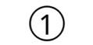
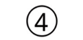
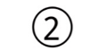
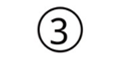

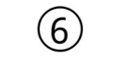

Code
=================================

:red:`You need remove Bluetooth Module Module first when you upload code.`

This project has many labels.

“Freenove_IR_Remote_Keycode.h” is used to save key code of IR remote control.

Freenove_IR_Remote_Keycode.h
--------------------------------

.. literalinclude:: ../../../freenove_Kit/Sketches/04.2_IR_Remote_Car/Freenove_4WD_Car_for_Arduino.h
    :linenos: 
    :language: c
    :dedent:

04.3_Multifunctional_IR_Remote_Car.ino
------------------------------------------

.. literalinclude:: ../../../freenove_Kit/Sketches/04.3_Multifunctional_IR_Remote_Car/04.3_Multifunctional_IR_Remote_Car.ino
    :linenos: 
    :language: c
    :dedent:

Compared to the previous project, this code has more switch-case branches of the remote key code for controlling the light bar.

.. literalinclude:: ../../../freenove_Kit/Sketches/04.3_Multifunctional_IR_Remote_Car/04.3_Multifunctional_IR_Remote_Car.ino
    :linenos: 
    :language: c
    :lines: 65-98
    :dedent:

In the loop(), control the behavior of the light bar based on these variables above.

The variable stripDisplayMode is used to control the display mode of the LED.

The variable stripDisplayDelay is used to control the cycle time of the LED, that is, the speed of change.

The variable colorStep is used to control the color value change for each iteration.

.. literalinclude:: ../../../freenove_Kit/Sketches/04.3_Multifunctional_IR_Remote_Car/04.3_Multifunctional_IR_Remote_Car.ino
    :linenos: 
    :language: c
    :lines: 114-142
    :dedent: