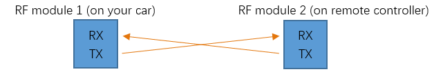

##############################################################################
Chapter 5 RF Remote Control
##############################################################################

If you purchased the kit without RF remote control, you can skip this chapter.

If you have any concerns, please feel free to contact us via support@freenove.com

5.1 Remote Control
**************************************

Download tutorial and code to assemble remote controller.

https://github.com/Freenove/Freenove_Remote_Control_Kit/archive/master.zip

For all resources, please refer to https://github.com/Freenove/Freenove_Remote_Control_Kit

Upload Code and Running
================================

Connect remote controller to computer. And upload code in Sketches\\05.1_RF24_Remote_Controller. 

Then turn on the power of RF remote control. You need remove Bluetooth Module first when you upload code.

05.1_RF24_Remote_Controller
-----------------------------------

The code is below:

.. literalinclude:: ../../../freenove_Kit/Sketches/05.1_RF24_Remote_Controller/05.1_RF24_Remote_Controller.ino
    :linenos: 
    :language: c
    :dedent:

You can change the address if you have two Freenove remote to control different cars, like Free2. But it is necessary to keep it same to the address in code in car.

.. literalinclude:: ../../../freenove_Kit/Sketches/05.1_RF24_Remote_Controller/05.1_RF24_Remote_Controller.ino
    :linenos: 
    :language: c
    :lines: 51-58
    :dedent:

When joystick is in center place, its value is about x=512, y=512

When joystick is pressed, z=0; when it is not pressed, z=1.

Switches are the same, when switch is on, s=0; when switch is off, s=1.

5.2 Receive RF Remote Control Data
*****************************************

Install RF module on the car. RF module and IR receiver use the same receiver pins. 

Upload Code and Running
===================================

Then connect car control board to computer. And upload code in Sketches\\05.2_Receive_Data. 

:red:`You need remove Bluetooth Module first when you upload code.`

**Power the remote controller.**

Keep car control board connected to computer via USB cable and open the serial monitor. You will see contents as below. 

**Operate the remote controller and observe the data change.**

Data to components
--------------------------

Code
==================================

05.2_Receive_Data
-----------------------------------

The code is below.

.. literalinclude:: ../../../freenove_Kit/Sketches/05.2_Receive_Data/05.2_Receive_Data.ino
    :linenos: 
    :language: c
    :dedent:

The communication is as follows:

**radio.write(dataWrite, sizeof(dataWrite)** Transfer the data.
Both of the codes for car and for remote have following contents:

.. code-block:: c
    :linenos:

    const byte addresses[6] = "Free1";
        ......
        radio.openWritingPipe(addresses);   // open a pipe for writing
        radio.openReadingPipe(1, addresses);// open a pipe for reading

This is used to set writing (transmitting) and reading (receiving) addresses of the RF24L01 module. Module B can receive the data of module A, only when the writing address of module A is the same as the reading address of module B. The module's own writing and reading addresses can be the same or different. When there are many RF modules around, the writing and reading addresses can be changed to avoid interference from other devices.

After we receive data from remote, we will recognize which component is operated according to the data change.

5.3 RF Remote Car
***********************************

After successfully receiving the data sent by the RF remote control, we can use the data to control car movement, buzzer sounds, etc.

Upload Code and Running
====================================

Connect Car to computer with USB cable, and upload code in Sketches\\05.3_RF24_Remote_Car.ino.

:red:`You need remove Bluetooth Module first when you upload code.`

Then disconnect the USB cable and turn on the RF Remote Control and Car power switches. Operate the joystick to control the movement of the car. Press the joystick to turn on the buzzer.

Code
====================================

The project has five labels, of which "RF24_Remote.h" and "RF24_Remote.cpp" store contents about data reading and data processing for the RF24 remote control. These contents are called in "05.3_RF24_Remote_Car.ino".

RF24_Remote.h
------------------------------------

.. literalinclude:: ../../../freenove_Kit/Sketches/05.3_RF24_Remote_Car/RF24_Remote.h
    :linenos: 
    :language: c
    :dedent:

Where enum RemoteData defines the order of the remote control data received, using more meaningful variable names instead of numbers. For example, if you want to use the X-axis data of the remote control, you can use RFDataRead[JOYSTICK_X] instead of the no meaningless RFDataRead[2]. It like define 

.. literalinclude:: ../../../freenove_Kit/Sketches/05.3_RF24_Remote_Car/RF24_Remote.h
    :linenos: 
    :language: c
    :lines: 17-27
    :dedent:

The enum RemoteMode defines all states of the remote control switches S1, S2, S3. The enum RemoteModeSwitchState defines the state when the remote control switches modes. These contents will also be used in the next project.

.. literalinclude:: ../../../freenove_Kit/Sketches/05.3_RF24_Remote_Car/RF24_Remote.h
    :linenos: 
    :language: c
    :lines: 28-43
    :dedent:

.. c:function:: bool RF24L01Setup();	
    
    Initialize RF24L01. If success, return true, if not, return false.

.. c:function:: bool getRF24L01Data();	
    
    Read data from remote control. If there is data read, return true; if not, return false. 

.. c:function:: void updateCarActionByRFRemote();	
    
    Control car actions (mainly for motor and buzzer) according to data received.

.. c:function:: void resetRFDataBuf();	

    Set values of RFData array to default values.

.. c:function:: u8 updateRFCarMode();	

    Combine data of S1 S2 S3 of remote control into one value and return it.

05.3_RF24_Remote_Car.ino
---------------------------------

.. literalinclude:: ../../../freenove_Kit/Sketches/05.3_RF24_Remote_Car/05.3_RF24_Remote_Car.ino
    :linenos: 
    :language: c
    :dedent:

In setup(), initialize pins and RF24L01. In loop(), receive data from the remote control and process the data. If receiving data is time out, the remote control signal is considered to be lost and the car will be placed in the initialization state.

5.4 Multifunctional RF24 Remote Car
******************************************

This project combines almost all functions of the car, such as obstacle avoidance mode, line tracking mode, remote control mode, RGB LED display mode, servo position calibration and so on. The switching among different functions is realized by switching the states of S1, S2, and S3 on the remote controller.

The project code is more complicated, but the components and knowledge used have been introduced in the previous project. The only difference is that they are integrated into one project, which is quite large.

Upload Code and Running
============================================

Connect Car to computer with USB cable. 

You need remove Bluetooth Module first when you upload code.

And upload code in Sketches\\05.5_One_Code_Multifunctional_RF24_Remote_Car

You can also choose to Sketches\\05.4_Multifunctional_RF24_Remote_Car.ino.

Disconnect the USB cable. Turn on the power of the remote control and the car. By default, the car is in manual remote control mode, and the S1, S2, and S3 switches on the remote control are off.

Switch different modes
-------------------------------------------

1, Change the switch state of S1, S2, and S3, and the car will stop moving.

2, Press the Z axis of the joystick and the buzzer B sounds to indicate that the mode is successfully switched.

The following table shows the modes indicated by different states of the three switches S1, S2, and S3. The LED next to the switch illumination to indicate ON and OFF state of switches. The three switches can form 2x2x2=8 modes.

+-----+-----+-----+----------+------------------------------------+
| S1  | S2  | S3  | Mode No. | Mode                               |
+-----+-----+-----+----------+------------------------------------+
| ON  | ON  | ON  | 0        | None                               |
+-----+-----+-----+----------+------------------------------------+
| ON  | ON  | OFF | 1        | Calibrate servo mode               |
+-----+-----+-----+----------+------------------------------------+
| ON  | OFF | ON  | 2        | None                               |
+-----+-----+-----+----------+------------------------------------+
| ON  | OFF | OFF | 3        | Obstacle avoidance mode            |
+-----+-----+-----+----------+------------------------------------+
| OFF | ON  | ON  | 4        | None                               |
+-----+-----+-----+----------+------------------------------------+
| OFF | ON  | OFF | 5        | Line tracking mode                 |
+-----+-----+-----+----------+------------------------------------+
| OFF | OFF | ON  | 6        | Switch LED mode                    |
+-----+-----+-----+----------+------------------------------------+
| OFF | OFF | OFF | 7        | Manuel control mode / Default mode |
+-----+-----+-----+----------+------------------------------------+

Mode 0, 2, 4
------------------------------------------

Reserved. We did not assign functions for them. 

Mode 1-Calibrate servo
--------------------------------------------

If your servo is not accurately mounted at 90 degrees, you can use this mode for fine adjustment (+-10 degrees).

In this mode, you can adjust potentiometer 2 (POT2) to fine tune the angle of the servo. When you adjust the servo to the correct angle, press the Z-axis of joystick to save calibration data to EEPROM. It will be saved permanently unless it is modified.

Mode 3-obstical avoidance, Mode 5-line tracking mode
--------------------------------------------

These two modes have been learned separately in the previous project, and their running logic and codes are consistent with the previous project.

The difference is that in this project, the car can respond to commands from the remote control at any time. Therefore, in this project, it is still necessary to communicate with the remote controller in these two modes. When the remote control signal is disconnected, the car will stop. Therefore, the normal communication between the remote control and the car should be maintained at any time. Poor communication conditions may cause these two modes to work abnormally.

Mode 6-switch LED display mode
--------------------------------------------

There are three display modes for the LEDs on the car, which are 0-flowing rainbow, 1-flowing water led, 2-Blink. In this mode, the display mode of the LED can be switched.

After entering this mode,

Move the joystick along the positive direction of its X-axis to switch the LED to the next mode.

Move the joystick in the negative direction of its X-axis to switch the LED to the previous mode.

In any mode, the LEDs can be adjusted with potentiometers P1 and P2. P1 is used to adjust the color change of the LED, and P2 is used to adjust the change frequency of LED.

Mode 7- manual remote mode
-------------------------------------------

This mode is manual remote mode and is the default mode. This mode is consistent with the previous project "RF_Remote_Car". Use the joystick to control to move forward, move back and turn left, turn right.

Code
=========================================

There are 9 (file) labels for this project, 8 of which have appeared in previous projects. In the file "05.4_Multifunctional_RF24_Remote_Car.ino", it is mainly the logical management of each module function, such as switching of the car mode, switching of the LED display mode.

05.4_Multifunctional_RF24_Remote_Car.ino
-----------------------------------------

.. literalinclude:: ../../../freenove_Kit/Sketches/05.4_Multifunctional_RF24_Remote_Car/05.4_Multifunctional_RF24_Remote_Car.ino
    :linenos: 
    :language: c
    :dedent:

In setup(), initialize pins and RF24L01 and LED module. In loop(), receive data from the remote control and process the data. If receiving data is time out, the remote control signal is considered to be lost. LED display code is added in this code, which is different from code in the previous project.

.. code-block:: c
    :linenos:

    void setup() {
	    pinsSetup();
        if (!RF24L01Setup()) {
            alarm(4, 2);
        }
        servoSetup();
        while (!strip.begin());
        strip.setAllLedsColor(0xFF0000);
    }

    void loop() {
        if (getRF24L01Data()) {
            ...
	    }

        if (millis() - lastRFUpdateTime > RF_UPDATE_TIMEOUT) {
            lastRFUpdateTime = millis();
            resetRFDataBuf();
            updateCarActionByRFRemote();
            RFCarMode = lastRFCarMode = MODE_REMOTE_CONTROL;
        }
        switch (stripDisplayMode)
        {
            ...
        }
    }

After reading the remote control data, judge whether the mode of the car has changed according to the state of S1, S2, S3. If the mode is changed, the code of the corresponding mode will be executed. Otherwise, the subsequent code will be executed.

.. code-block:: c
    :linenos:

    if (getRF24L01Data()) {
		RFCarMode = updateRFCarMode();
		if (RFCarMode != lastRFCarMode) {
			if (switchModeState == MODE_SWITCHING_WAS_FINISHED) {
				switchModeState = MODE_SWITCHING_IS_INITIALIZING;
			}
			switch (switchModeState)
			{
                ...
			}
            ...
		}
    else {
        ...
    }

When the state of S1, S2, S3 changes, it means that the user wants to change the mode of the car, but in order to ensure that this change is not an erroneous operation, the user needs to press the Z axis of the joystick to confirm.

This series of actions can be implemented using the idea of a finite state machine. When the switch state changes, the state "MODE_SWITCHING_IS_INITIALIZING" is entered, the car's power module, motor and servo are initialized to prevent the car from running uncontrolledly.

.. literalinclude:: ../../../freenove_Kit/Sketches/05.4_Multifunctional_RF24_Remote_Car/05.4_Multifunctional_RF24_Remote_Car.ino
    :linenos: 
    :language: c
    :lines: 54-59
    :dedent:

Then enter next state "MODE_SWITCHING_IS_PROCESSING" and wait for the user to press the rocker Z axis to confirm. If the user presses the Z axis of the joystick, the buzzer sounds and enters the next state "MODE_SWITCHING_IS_CONFIRMING", waiting for the user to release the joystick. When the user releases the joystick, the buzzer stops sounding and changes the value of the variable switchModeState that holds the car mode. After the mode is switched, the completion status "MODE_SWITCHING_WAS_FINISHED" is entered.

.. literalinclude:: ../../../freenove_Kit/Sketches/05.4_Multifunctional_RF24_Remote_Car/05.4_Multifunctional_RF24_Remote_Car.ino
    :linenos: 
    :language: c
    :lines: 60-91
    :dedent:

Next, use the switch-case statement to let the car perform the corresponding function or action according to the value of the car mode variable RFCarMode.

.. code-block:: c
    :linenos:

    switch (RFCarMode)
    {
        case ON_ON_ON:
            break;
        case ON_ON_OFF:   //S1,S2 ON, S3 OFF
            ...//Set Servo offset
        case ON_OFF_ON:
            break;
        case ON_OFF_OFF:  ////Sonic Obstacle Avoidance Mode, S1 is ON and S2, S3 are OFF
            updateAutomaticObstacleAvoidance();
            break;
        case OFF_ON_ON:
            break;
        case OFF_ON_OFF:    //Tracking Mode, S2 is ON and S1, S3 are OFF.
            updateAutomaticTrackingLine();
            break;
        case OFF_OFF_ON:    //S3 is ON and S1, S2 are OFF
            ...//Change LED Mode
            break;
        case OFF_OFF_OFF:   //Remote Mode, all switch leds are OFF
            updateCarActionByRFRemote();
            break;
        default:
            break;
    }

In the calibration servo mode, the angle of the servo is adjusted according to the value of the potentiometer POT2. When the rocker Z-axis is pressed, the adjusted data is written into the EEPROM, and the buzzer will make a sound to confirm the writing.

.. literalinclude:: ../../../freenove_Kit/Sketches/05.4_Multifunctional_RF24_Remote_Car/05.4_Multifunctional_RF24_Remote_Car.ino
    :linenos: 
    :language: c
    :lines: 102-111
    :dedent:

In the mode of switching the LED display, the idea of finite state machine is still used.

First, enter the initialization state, waiting for the joystick to move in the direction of the X axis. If there is, the variable switchCounter will be self-added or self-decremented according to the positive and negative directions. Then enter next state, wait for the joystick to return to the middle. When the joystick returns to the middle, enter the next state, process the data, after the data processing is completed, enter the completion state.

.. literalinclude:: ../../../freenove_Kit/Sketches/05.4_Multifunctional_RF24_Remote_Car/05.4_Multifunctional_RF24_Remote_Car.ino
    :linenos: 
    :language: c
    :lines: 124-163
    :dedent:

The variable that controls the LED display color change and the variable of the display frequency are updated every time according to remote control data.

.. literalinclude:: ../../../freenove_Kit/Sketches/05.4_Multifunctional_RF24_Remote_Car/05.4_Multifunctional_RF24_Remote_Car.ino
    :linenos: 
    :language: c
    :lines: 172-173
    :dedent:

Finally, the LED display mode variable stripDisplayMode, the color change amplitude variable colorStep, the display period variable stripDisplayDelay.

.. literalinclude:: ../../../freenove_Kit/Sketches/05.4_Multifunctional_RF24_Remote_Car/05.4_Multifunctional_RF24_Remote_Car.ino
    :linenos: 
    :language: c
    :lines: 183-228
    :dedent: