##############################################################################
Chapter 6 Bluetooth control
##############################################################################

This section requires an Android or iPhone device with Bluetooth to control the car. 

If you have any concerns, please feel free to contact us via support@freenove.com

6.1 Set Bluetooth and Receive Data
******************************************************

Android and iPhone iOS App
==============================================

Download and install app. You can use app to control the robot.

You can download Freenove App through below ways:

View or download on Google Play:

https://play.google.com/store/apps/details?id=com.freenove.suhayl.Freenove

Or download APK file directly

https://github.com/Freenove/Freenove_App_for_Android/raw/master/freenove.apk

Then install it on your Android phone.

For **iPhone app**, please serach **freenove** in **App Store**.

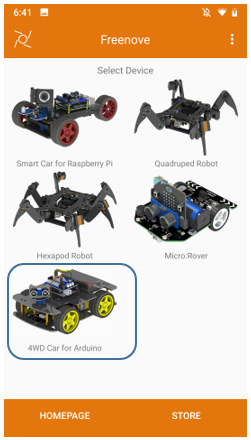

Instructions for using the Bluetooth module
=================================================

The Bluetooth module uses the serial port to communicate with the Arduino. The serial communication is also used to upload the program to Arduino. :red:`Therefore, when uploading the program to Arduino, the Bluetooth module should be unplugged; otherwise, the program upload will fail!`

When the Bluetooth module is not connected by other device, the Bluetooth module can be configured using the AT command. Once connected, the Bluetooth module acts as a data pipe and cannot be configured.

By default, the Bluetooth module has a baud rate of 115200, no parity, 8 data bits, and 1 stop bit. Bluetooth name "BT05", role mode is slave mode.

Set name of bluetooth
-----------------------------

If you have multiple Bluetooth modules with the same name around you, you will be confused when you connect. Which one is the Bluetooth module I want to connect to?

In the next project, we will introduce how to use the AT command to modify the name of the Bluetooth module and the master-slave role in the program.

For AT commands and more information about the Bluetooth module, refer to the documentation in the package for Datasheets/BT05-Instruction.pdf

This project uses the AT command to make some settings for the Bluetooth module, then uses the Bluetooth module to receive data from the app and print the data on the serial monitor.

Upload Code and Running
================================================

:red:`You need remove Bluetooth Module first when you upload code.`

Then upload code in Sketches/06.1_Receive_Bluetooth_Data.ino. 

.. note:: :red:`when upload code, we need unplug Bluetooth first. Or the uploading will fail.`

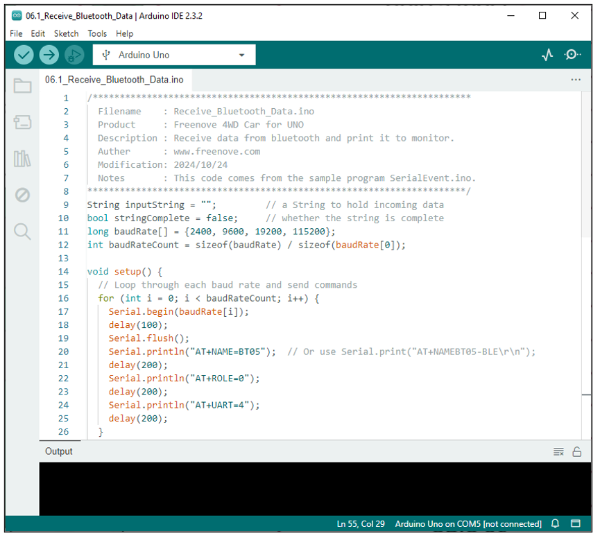

After the code is successfully uploaded, follow the steps below.

1.	Plug the Bluetooth module on car as shown below. :red:`Don't reverse it. The wrong connection may damage your hardware.`

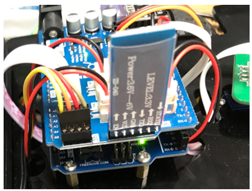

Please note: your Bluetooth module may also be this way. They are universal.

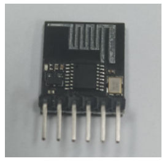

2. Open Arduino monitor. Reset uno board.

As shown in the figure below, the Bluetooth name is set to “BT05” and the Bluetooth mode is slave mode (ROLE=0).

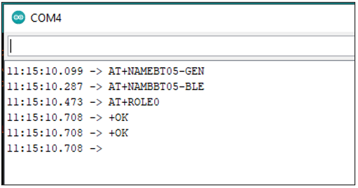

Next, open the app and click the 4WD Car for Arduino.

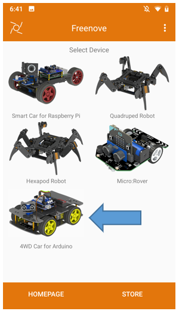

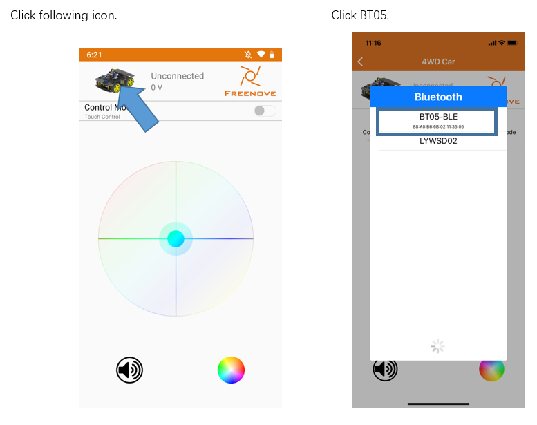

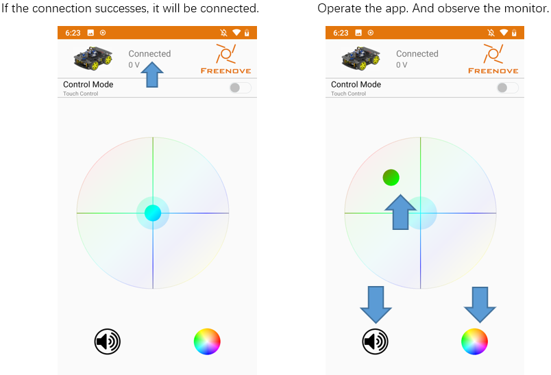

The monitor will show content below:

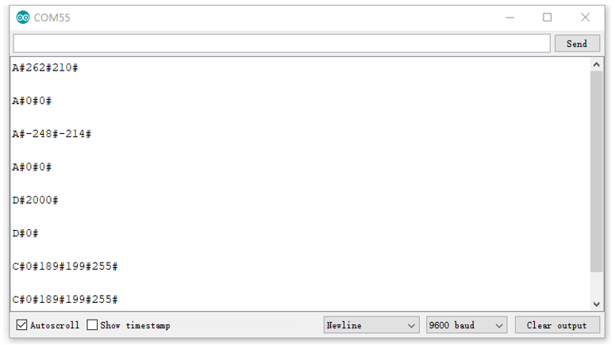

Bluetooth data- car action
-----------------------------------------

The command format for communication between app and car is A#xxx#xxx#...xxx#, where # is a separator, the first character A represents the action command, it can be other characters, such as B, C, D…The xxx represents the parameters of the action command. And different commands carry different parameters. The command list is as below:

+----------------+---------------------------------------------------------+-------------------+----------------------+--------------------+
|Action command  |Description                                              |Command character  |Number of parameters  |Format example      |
|                |                                                         |                   |                      |                    |
|                |                                                         |                   |(app send/receive)    |(app send/receive)  |
+================+=========================================================+===================+======================+====================+
| MOVE           | Move, parameters are speeds of the two motors           | A                 | 2                    | A#100#100#         |
+----------------+---------------------------------------------------------+-------------------+----------------------+--------------------+
| STOP           | Stop moving                                             | B                 | 0                    | B#                 |
+----------------+---------------------------------------------------------+-------------------+----------------------+--------------------+
| LED_RGB        | Control RGBLED, parameters respectively are serial      | C                 | 3                    | C#2#100#150#200#   |
|                |                                                         |                   |                      |                    |
|                | number of LED mode, red value, green value, blue value. |                   |                      |                    |
+----------------+---------------------------------------------------------+-------------------+----------------------+--------------------+
| BUZZER         | Control buzzer, and parameter is the frequency.         | D                 | 1                    | D#2000#            |
+----------------+---------------------------------------------------------+-------------------+----------------------+--------------------+
| VOLTAGE        | Get the batteries voltage, parameter                    | I                 | 0/1                  | I# /I#4100#        |
|                |                                                         |                   |                      |                    |
|                | is the voltage value, unit mV                           |                   |                      |                    |
+----------------+---------------------------------------------------------+-------------------+----------------------+--------------------+

Code
======================================

06.1_Receive_Bluetooth_Data
------------------------------------

The data of the Bluetooth module is sent to the Arduino through the serial port. The project code comes from the Arduino example code "SerialEvent". Receive data from the serial port and print the data when ‘\n’ is received.

The code is below:

.. literalinclude:: ../../../freenove_Kit/Sketches/06.1_Receive_Bluetooth_Data/06.1_Receive_Bluetooth_Data.ino
    :linenos: 
    :language: c
    :dedent:

The default data transmission baud rate of the Bluetooth module is 115200, so set serial port baud rate to 115200.

.. literalinclude:: ../../../freenove_Kit/Sketches/06.1_Receive_Bluetooth_Data/06.1_Receive_Bluetooth_Data.ino
    :linenos: 
    :language: c
    :lines: 29-29
    :dedent:

Then use the AT command to set the name of the Bluetooth module to "BT05". The format of the command is "AT+NAME=xxx\r\n", where "AT+NAME" is a fixed format, and the following "xxx" is the set name. The maximum length of the name is 18 characters. The command must be followed by "\r\n" ends. Since the Serial.pirntln() function adds "\r\n" to the end, there is no need to add it in the program. The delay is 200ms to ensure that the Bluetooth module has enough time to complete the setup.

.. literalinclude:: ../../../freenove_Kit/Sketches/06.1_Receive_Bluetooth_Data/06.1_Receive_Bluetooth_Data.ino
    :linenos: 
    :language: c
    :lines: 20-21
    :dedent:

Similarly, continue to use the AT command to set the Bluetooth module's role mode to slave mode. The Bluetooth module can be set to master mode or slave mode. In master mode, the Bluetooth module can actively search for and connect to other Bluetooth devices, but cannot be searched and connected by other devices. In order to be searched by the mobile app via Bluetooth, the Bluetooth role module needs to be set to the slave mode. According to the Bluetooth manufacturer's manual, 0 is the slave mode and 1 is the master mode.

.. literalinclude:: ../../../freenove_Kit/Sketches/06.1_Receive_Bluetooth_Data/06.1_Receive_Bluetooth_Data.ino
    :linenos: 
    :language: c
    :lines: 22-23
    :dedent:

In loop(), keep querying if stringComplete is true. If it is true, it indicates that the complete data has been received. The data will be printed on the serial monitor, and then the data is cleared. And then the array is ready to receive new data.

.. literalinclude:: ../../../freenove_Kit/Sketches/06.1_Receive_Bluetooth_Data/06.1_Receive_Bluetooth_Data.ino
    :linenos: 
    :language: c
    :lines: 37-42
    :dedent:

Function serialEvent() is used to receive the data transmitted by the serial port. When the newline character is received, the flag stringComplete is set to true, and the received data will be printed in loop().

.. literalinclude:: ../../../freenove_Kit/Sketches/06.1_Receive_Bluetooth_Data/06.1_Receive_Bluetooth_Data.ino
    :linenos: 
    :language: c
    :lines: 50-62
    :dedent:

.. py:function:: Bluetooth AT Command
    
    AT command mode when the module is not connected.
    
    AT command, which belongs to the character line instruction, is parsed according to the line
    
    (That is, AT command must be returned by carriage return or \r\n, hexadecimal number is 0D0A).
    
    For more details about AT command, please refer to Datasheets/BT05-Instruction.pdf.

.. c:function:: void serialEvent()

    SerialEvent occurs whenever a new data comes in the hardware serial RX. This routine is run between each time loop() runs, so using delay inside loop can delay response. Multiple bytes of data may be available. 

6.2 Bluetooth Remote Car
****************************************

After learning how to receive the app's data via Bluetooth and the meaning of data formats, use the data to let the car do something. Control the car movement, the buzzer sounds, and the LED switches the display mode.

Upload Code and Running
=========================================

:red:`You need remove Bluetooth Module first when you upload code.`

And connect car to computer with USB cable. 

Then upload code in Sketches/06.2_Bluetooth_Remote_Car.ino.

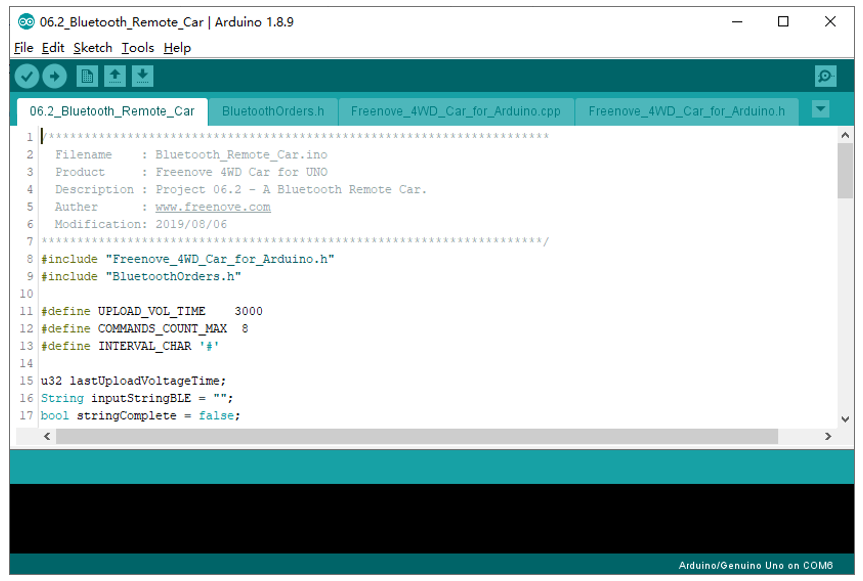

**After the code is successfully uploaded, unplug the USB cable and plug the Bluetooth module on car. Turn on the car power switch.**

According to the previous way, the Bluetooth module of the car is connected through app, then the car can be controlled by clicking or sliding the operation panel on the APP.

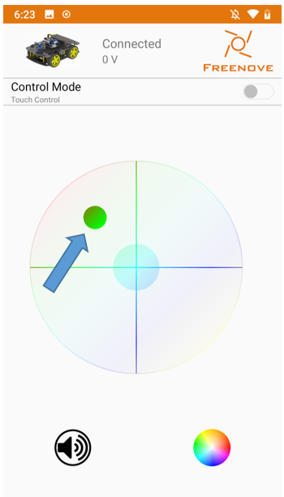

Code
===========================================

The project has 4 labels, the label "BluetoothOrders.h" stores Bluetooth communication, and command characters are used to control the car, only a part of which is used. The main label "06.2_Bluetooth_Remote_Car.ino" is the main content of this project.

BluetoothOrders.h
--------------------------------------------

.. literalinclude:: ../../../freenove_Kit/Sketches/06.2_Bluetooth_Remote_Car/BluetoothOrders.h
    :linenos: 
    :language: c
    :dedent:

06.2_Bluetooth_Remote_Car.ino
---------------------------------------------

.. literalinclude:: ../../../freenove_Kit/Sketches/06.2_Bluetooth_Remote_Car/06.2_Bluetooth_Remote_Car.ino
    :linenos: 
    :language: c
    :dedent:

In loop (), the voltage value is uploaded to app at intervals.

.. literalinclude:: ../../../freenove_Kit/Sketches/06.2_Bluetooth_Remote_Car/06.2_Bluetooth_Remote_Car.ino
    :linenos: 
    :language: c
    :lines: 26-29
    :dedent:

In the sub-function upLoadVoltageToApp(), first read the battery voltage, then convert the voltage unit to mv, and send it in the format of "I#xxx#". Use Serial.println() to send a Newline character '\n', after sending the previous data,

.. literalinclude:: ../../../freenove_Kit/Sketches/06.2_Bluetooth_Remote_Car/06.2_Bluetooth_Remote_Car.ino
    :linenos: 
    :language: c
    :lines: 66-73
    :dedent:

Then in loop(), if the required data is received, the data will be parsed into commands and parameters and will be saved in an array. 

Suppose you receive a command string of "A#100#200#". First use the String.indexOf() function to find the position of the separator "#". And then use the String.substring() function to split the command string into " A" and "100#200#", and save the first element "A" that is split in the array "inputCommandArray". 

And then continue to repeat this operation on the split string "100#200#". You can split the element "A" into "100" and "200" respectively and save them in arrays. Finally, convert these elements to integer types and save them in the parameter array paramters.

.. code-block:: c
    :linenos:

    if (stringComplete) {
    String inputCommandArray[COMMANDS_COUNT_MAX];
    int paramters[COMMANDS_COUNT_MAX], paramterCount = 0;
    String inputStringTemp = inputStringBLE;
    for (u8 i = 0; i < COMMANDS_COUNT_MAX; i++) {
        int index = inputStringTemp.indexOf(INTERVAL_CHAR);
        if (index < 0) {
            break;
        }
        paramterCount = i;  //
        inputCommandArray[i] = inputStringTemp.substring(0, index);
        inputStringTemp = inputStringTemp.substring(index + 1);
        paramters[i] = inputCommandArray[i].toInt();
    }
    ...

Finally, let the car perform different actions according to the commands and parameters.

.. literalinclude:: ../../../freenove_Kit/Sketches/06.2_Bluetooth_Remote_Car/06.2_Bluetooth_Remote_Car.ino
    :linenos: 
    :language: c
    :lines: 47-62
    :dedent:

.. py:function:: indexOf()	
    
    :orange:`Description`
    
        Locates a character or String within another String. By default, it searches from the beginning of the String, but it can also start from a given index, allowing for the locating of all instances of the character or String.
    
    :orange:`Syntax`
    
        myString.indexOf(val)

        myString.indexOf(val, from)
    
    :orange:`Parameters`
    
        myString: a variable of type String.

        val: the value to search for. Allowed data types: char, String.

        from: the index to start the search from.
    
    :orange:`Returns`
    
        The index of val within the String, or -1 if not found.

.. py:function:: substring()	

    :orange:`Description`
    
        Get a substring of a String. The starting index is inclusive (the corresponding character is included in the substring), but the optional ending index is exclusive (the corresponding character is not included in the substring). If the ending index is omitted, the substring continues to the end of the String.
    
    :orange:`Syntax`
    
        myString.substring(from)

        myString.substring(from, to)
    
    :orange:`Parameters`
    
        myString: a variable of type String.

        from: the index to start the substring at.

        to (optional): the index to end the substring before.
    
    :orange:`Returns`
    
        The substring. 

.. py:function:: toInt()	

    :orange:`Description`
        
        Converts a valid String to an integer. The input String should start with an integer number. If the String contains non-integer numbers, the function will stop performing the conversion.
    
    :orange:`Syntax`
    
        myString.toInt()
    
    :orange:`Parameters`
    
        myString: a variable of type String.
    
    :orange:`Returns`
    
        If no valid conversion could be performed because the String doesn't start with an integer number, a zero is returned. Data type: long.

    More information refer to: https://www.arduino.cc/reference/en/language/variables/data-types/stringobject/

6.3 Multifunctional Bluetooth Remote Car
****************************************************

This project adds the function of LED display and the function of LED display mode switching on the basis of the previous project.

Upload Code and Running
=================================================

Connect car to computer with USB cable. 

1 You need remove Bluetooth Module first when you upload code.

2 Then upload the code in Sketches/06.4_One_Code_Multifunctional_Bluetooth_Remote_Car.

3 After upload, reconnect the Bluetooth and reset the uno board.

And you can also upload code in Sketches/06.3_Multifunctional_Bluetooth_Remote_Car.ino. The code is same.

Don't separate the files in the folder.

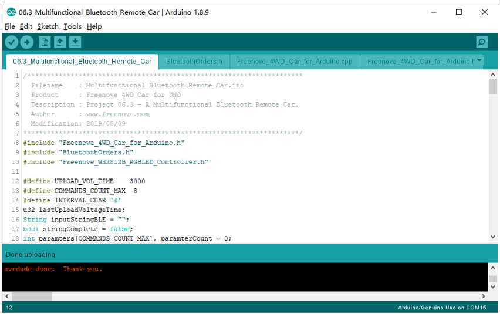

After the code is successfully uploaded, unplug the USB cable and plug the Bluetooth module on car. Turn on the car power switch.

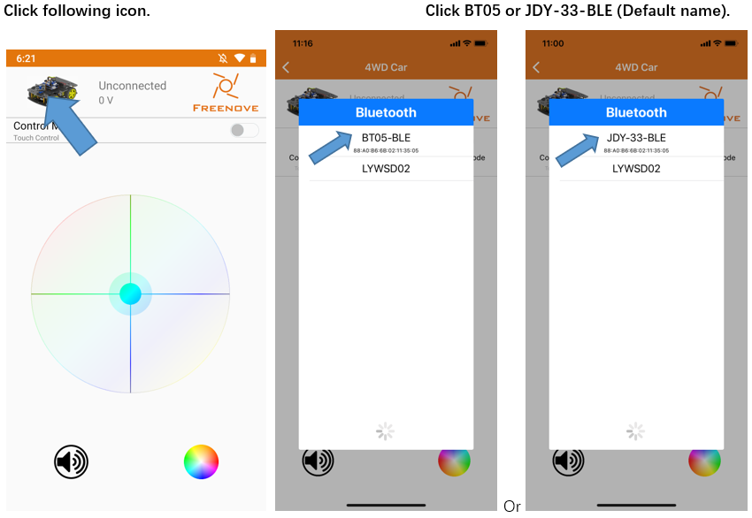

According to the previous method, connect Bluetooth module of the car with the app, and the operation panel of the APP can be clicked or swiped to control the movement of the car. And the color palette of the lower right corner can be clicked to control the display mode and color of the LED. Among them,

Mode 0 is a flowing rainbow,

Mode 1 is a flowing water LED with color changing.

Mode 2 is a color-adjustable Blink.

Mode 3 displays the selected color of the current color picker for all LEDs.

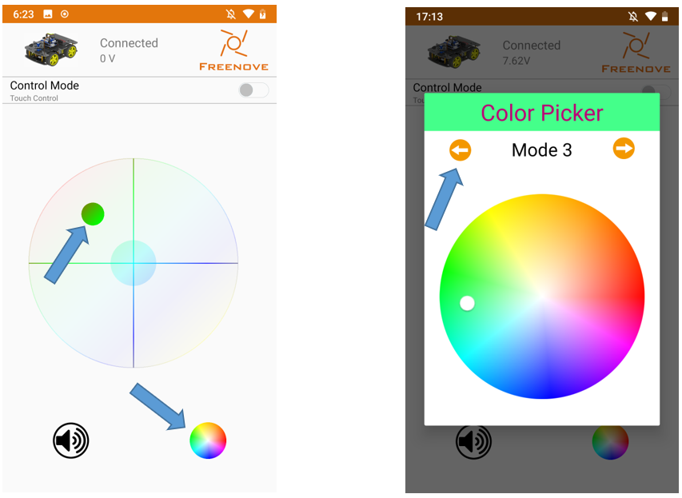

Code
===================================================

The code for this project is based on the previous engineering code, adding code related to LED control. Nothing else has changed.

06.3_Multifunctional_Bluetooth_Remote_Car
----------------------------------------------------

.. literalinclude:: ../../../freenove_Kit/Sketches/06.3_Multifunctional_Bluetooth_Remote_Car/06.3_Multifunctional_Bluetooth_Remote_Car.ino
    :linenos: 
    :language: c
    :dedent:

There are three action modes. MODE_GAVITY, MODE_ULTRASONIC and MODE_TRACKING.

.. literalinclude:: ../../../freenove_Kit/Sketches/06.3_Multifunctional_Bluetooth_Remote_Car/06.3_Multifunctional_Bluetooth_Remote_Car.ino
    :linenos: 
    :language: c
    :lines: 72-91
    :dedent:

In the app, four LED display modes can be switched and different color change ranges and color change periods are set according to different modes. That is, the values of the variables colorStep and stripDisplayDelay.

.. literalinclude:: ../../../freenove_Kit/Sketches/06.3_Multifunctional_Bluetooth_Remote_Car/06.3_Multifunctional_Bluetooth_Remote_Car.ino
    :linenos: 
    :language: c
    :lines: 65-123
    :dedent:

In loop(), the LED is displayed based on the received mode and parameters.

.. literalinclude:: ../../../freenove_Kit/Sketches/06.3_Multifunctional_Bluetooth_Remote_Car/06.3_Multifunctional_Bluetooth_Remote_Car.ino
    :linenos: 
    :language: c
    :lines: 139-194
    :dedent: