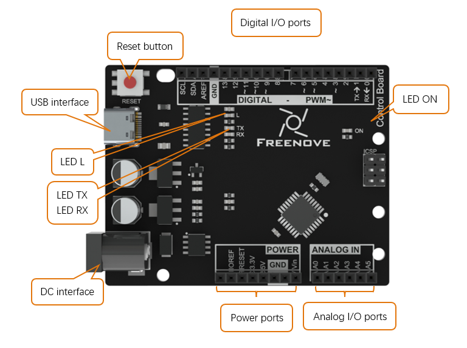
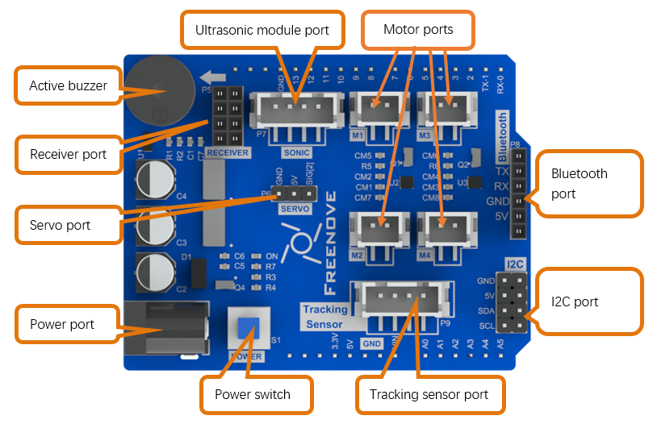

##############################################################################
Control Board and Software
##############################################################################

Control Board
****************************************************

Diagram of Freenove Control board is shown below:

- Digital I/O ports is used to connect to other components or modules, to receive an input signal, or to send a control signal. Usually, we name it by adding a "D" in front of the number, such as D13.

- Only digital I/O ports with “~” can output PWM, Pin 3, 5, 6, 9, 10, 11.

- USB interface is used to provide power, upload code or communicate with PC. 

- LED L is connected to digital I/O port 13 (D13).

- LED TX, RX is used to indicate the state of the serial communication. 

- DC interface is connected with DC power to provide power for the board.

- Power ports can provide power for electronic components and modules.

- Analog I/O ports can be used to measure analog signals. 

- LED ON is used to indicate the power state.

If you want to learn more about how to use Freenove control board to create interesting projects, please visit http://www.freenove.com/store.html for Arduino kits designed for beginners.

Extension Board
************************************************

Freenove 4WD Extension board is below:

Receiver port can connect to RF module or IR module.

Relationship between extension board and the control board is as below.

+-----------------+----------------------+------------------+-------------------------------------------+
| Pins of Arduino |  Ports of extension  | Pin multiplexing |                Description                |
+=================+======================+==================+===========================================+
| 0               | UART-Bluetooth       |                  | Bluetooth                                 |
+-----------------+                      +------------------+                                           +
| 1               |                      |                  |                                           |
+-----------------+----------------------+------------------+-------------------------------------------+
| 2               | Servo                |                  |                                           |
+-----------------+----------------------+------------------+-------------------------------------------+
| 3               | Direction-Right      |                  | Direction of right motor                  |
+-----------------+----------------------+------------------+-------------------------------------------+
| 4               | Direction-Left       |                  | Direction of left motor                   |
+-----------------+----------------------+------------------+-------------------------------------------+
| 5               | Motor-Right          |                  | Speed of right motor -PWM                 |
+-----------------+----------------------+------------------+-------------------------------------------+
| 6               | Motor-Left           |                  | Speed of left motor -PWM                  |
+-----------------+----------------------+------------------+-------------------------------------------+
| 7               | Trig                 |                  | Ultrasonic module                         |
+-----------------+----------------------+------------------+                                           +
| 8               | Echo                 |                  |                                           |
+-----------------+----------------------+------------------+-------------------------------------------+
| 9               | SPI-NRF24L01         | IR-remote        | CE/IR-remote                              |
+-----------------+                      +------------------+-------------------------------------------+
| 10              |                      |                  | CS                                        |
+-----------------+----------------------+------------------+-------------------------------------------+
| 11              | SPI-NRF24L01         |                  | MOSI                                      |
+-----------------+                      +------------------+-------------------------------------------+
| 12              |                      |                  | MISO                                      |
+-----------------+                      +------------------+-------------------------------------------+
| 13              |                      |                  | SCK                                       |
+-----------------+----------------------+------------------+-------------------------------------------+
| A0              | Battery voltage      | Buzzer           | The ADC uses an internal 5V               |
|                 |                      |                  |                                           |
|                 |                      |                  | reference and the acquisition voltage     |
|                 |                      |                  |                                           |
|                 |                      |                  | is the battery voltage \*1/4.             |
|                 |                      |                  |                                           |
|                 |                      |                  | Output to the Buzzer through the          |
|                 |                      |                  |                                           |
|                 |                      |                  | comparator. When higher than the          |
|                 |                      |                  |                                           |
|                 |                      |                  | 4.5V, output HIGH.                        |
+-----------------+----------------------+------------------+-------------------------------------------+
| A1              | Line-tracking sensor |                  | Left                                      |
+-----------------+                      +------------------+-------------------------------------------+
| A2              |                      |                  | Middle                                    |
+-----------------+                      +------------------+-------------------------------------------+
| A3              |                      |                  | Right                                     |
+-----------------+----------------------+------------------+-------------------------------------------+
| A4              | I2C                  |                  | SDA                                       |
+-----------------+                      +------------------+-------------------------------------------+
| A5              |                      |                  | SCL                                       |
+-----------------+----------------------+------------------+-------------------------------------------+
