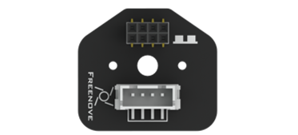
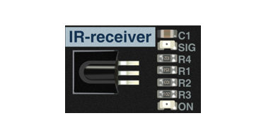

##############################################################################
List
##############################################################################

Acrylic Parts
******************************************************************************

The surface of the acrylic parts is covered with a layer of protective film. You need to remove it first.

Some holes in the acrylic parts may have residues. You also need to clean them before using.

Mechanical Parts
******************************************************************************

+-------------------------------------------------------------------------+
| |List01|                                                                |
+------------------+------------------------------------------------------+
|Servo x1          | Motor x4                                             |
|                  |                                                      |
| |List02|         | |List03|                                             |
|                  |                                                      |
|                  | :red:`Caution: Do not remove the cable tie from the` |
|                  |                                                      |
|                  | :red:`motor; otherwise, the motor cable may become`  |
|                  |                                                      |
|                  | :red:`detached.`                                     |
+------------------+------------------------------------------------------+
|Driver wheel x 4  | Motor bracket package x 4                            |
|                  |                                                      |
|                  | Screw M3*8 , Nut M3, Screw M3*30                     |
|                  |                                                      |
| |List04|         | |List05|                                             |
+------------------+------------------------------------------------------+

Electronic Parts
******************************************************************************

+----------------------------------------------------------------------------------------+
| Freenove control board (Your kit will randomly contain **one control board**)          |
|                                                                                        |
| |List06|                                                                               |
+----------------------------------------------------------------------------------------+
| Freenove 4WD extension board                                                           |
|                                                                                        |
| |List07|                                                                               |
+-----------------------------------------+----------------------------------------------+
| Line-tracking infrared sensor           | Ultrasonic module connector                  |
|                                         |                                              |
| |List08|                                | |List09|                                     |
+-----------------------------------------+----------------------------------------------+
| WS2812B_LED_controller                  | WS2812B_LED                                  |
|                                         |                                              |
| |List10|                                | |List11|                                     |
+-----------------------------------------+----------------------------------------------+
| Ultrasonic module                       | Bluetooth                                    |
|                                         |                                              |
| |List12|                                | |List13|                                     |
+-----------------------------------------+----------------------------------------------+
| Wires                                   | USB Cable                                    |
|                                         |                                              |
| |List14|                                | |List15|                                     |
+-----------------------------------------+----------------------------------------------+
| IRreceiver                              | Tape                                         |
|                                         |                                              |
| |List16|                                | |List17|                                     |
+-----------------------------------------+----------------------------------------------+
| IR remote                               | Battery holder                               |
|                                         |                                              |
| |List18|                                | |List19|                                     |
+-----------------------------------------+----------------------------------------------+
| RF remote kit package :red:`(only contained in the Version with RF remote control)`    |
|                                                                                        |
| |List20|                                                                               |
+----------------------------------------------------------------------------------------+ 

Tools
******************************************************************************

+----------------------------------------------------+
| Cross Screwdriver x1                               |
|                                                    |
| |List21|                                           |
+----------------------------------------------------+
| Socket x1 :red:`(only one is included in the kit)` |
|                                                    |
| |List22|                                           |
+----------------------------------------------------+

Needed but NOT Included
***************************************************************

+---------------------------------------------------------------+
| 18650 3.7V rechargeable lithium battery x2                    |
|                                                               |
| **It is easier to find proper battery on eBay than Amazon.**  |
|                                                               |
| Please refer to **About_Battery.pdf** in the unzipped folder. |
|                                                               |
| |List23|                                                      |
+---------------------------------------------------------------+

