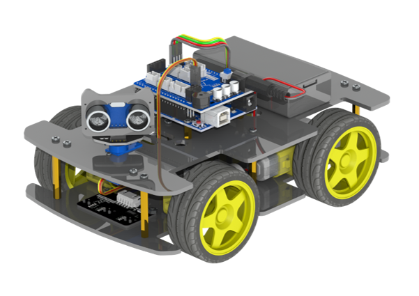

##############################################################################
Preface
##############################################################################

This 4WD Smart car is based on Arduino. 

This tutorial will start from controlling electronic components such as LED, motor, servo, to building multifunctional car.

Please follow the tutorial step by step patiently. 

If you have any concerns, please feel free to contact us. Our support team will provide quick and free customer service. 

support@freenove.com

